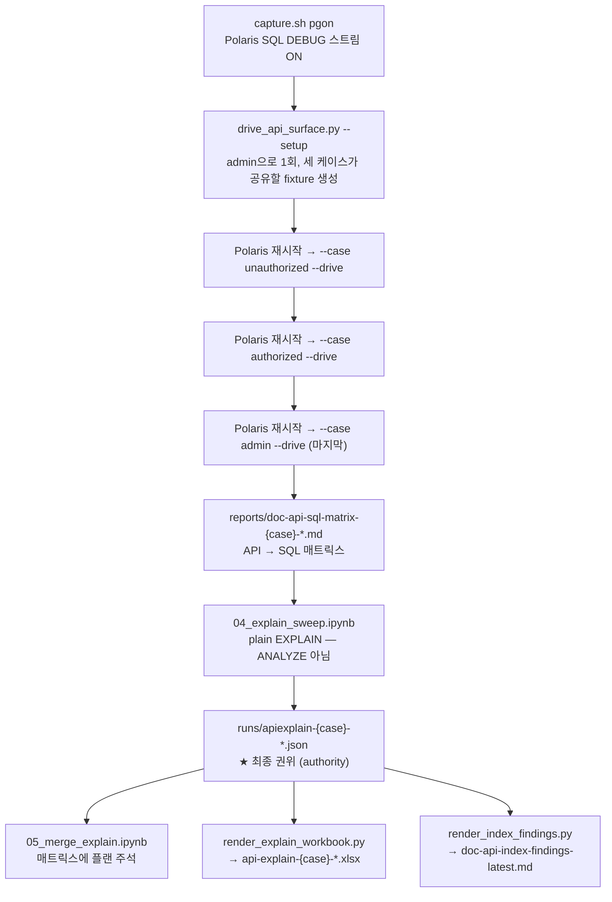

# Polaris API–SQL 프로파일 — 무엇을 측정했고, 워크북을 어떻게 읽나

**이 문서는 워크북을 읽기 위한 안내서입니다.** 특정 실행의 숫자와 결론은
[`doc-api-sql-profile-results-ko.md`](doc-api-sql-profile-results-ko.md)에 따로 있습니다.
스윕을 다시 돌리면 결과 문서만 갈아끼우면 되고, 이 문서는 그대로 유효합니다.

대상 파일: `reports/api-explain-{admin,authorized,unauthorized}-latest.xlsx` (케이스당 한 개, 8시트).

---

## 1. 이 분석은 무엇을 했나

Polaris **Management API**와 **Iceberg REST Catalog API**의 모든 오퍼레이션을,
그것이 PostgreSQL 메타스토어에 실제로 발행하는 SQL·건드리는 테이블·사용하는 접근 경로까지
한 단계 내려가서 매핑한 것입니다. "어떤 API가 어떤 API에 의존하나"가 아니라
**"어떤 API가 어떤 쿼리로 어떤 테이블의 어떤 행을 읽나"** 입니다.

우선순위대로 세 가지 질문에 답합니다.

1. **각 API는 어떤 테이블을 쓰나** → API → 테이블 매트릭스
2. **어떤 쿼리가 느린가** → 최댓값이 아니라 `평균 × 호출 수` 기준. 고쳐야 할 쿼리는
   가장 느린 단발성 쿼리가 아니라 **인가 경로 위에 있는 적당히 느린 쿼리**이기 때문입니다.
3. **없는데 있어야 할 인덱스는 무엇인가** → 문장별 접근 경로 판정

**세 번째가 이 분석의 존재 이유입니다.** 첫 두 개는 세 번째를 근거 있게 말하기 위한 준비입니다.

---

## 2. 측정 흐름



### 이 흐름을 성립시키는 설계 제약 세 가지

| 제약 | 이유 |
|---|---|
| **케이스마다 Polaris를 재시작한 뒤 드라이브** | `InMemoryEntityCache`가 콜드일 때 statement 집합이 **최대**가 됩니다. 그래야 캡처가 "이 API가 발행할 수 있는 모든 쿼리"를 담고, 세 케이스가 *서로* 비교 가능해집니다. 재시작을 빼면 세 케이스는 "먼저 돈 케이스"와 비교되는 것이 됩니다. 러너는 이 워밍 상태를 검증하지 못하므로 **재시작은 운영자의 몫**이고, `--drive`는 그 사실을 프린트합니다. |
| **`admin`을 마지막에** | 셋 중 `admin`만 상태를 변경합니다. 나머지 둘은 무언가를 건드리기 전에 거절당합니다. 마지막에 돌려야 앞의 두 케이스가 손대지 않은 fixture를 봅니다. |
| **스키마 무변경** | 인덱스를 하나 만들고 잰 플랜은 **아무도 운영하지 않는 DB에 대한 진술**이고, 사후에는 그렇지 않은 측정과 구분되지 않습니다. 측정 전에 `uv run python drop_grantee_index.py --list`로 스키마가 순정인지 확인합니다. 제안 인덱스 검증은 `02b`에서 **의도적으로** 따로 합니다. |

### `EXPLAIN`이지 `EXPLAIN ANALYZE`가 아닙니다

이게 두 가지를 동시에 가능하게 합니다.

- **쓰기(write) 문장도 물어볼 수 있습니다.** `ANALYZE`는 실행하므로 DELETE/UPDATE를 실제로 수행합니다. plain `EXPLAIN`은 실행하지 않으므로 43개 오퍼레이션의 쓰기 절반도 그대로 계획을 뜰 수 있습니다.
- **잘못 인용할 시계가 없습니다.** 여기서 나온 어떤 숫자도 지연시간이 아닙니다. 플랜 **모양(shape)** 은 결정적이지만 실행 시간은 아닙니다.

---

## 3. 왜 신원을 셋으로 나눴나

같은 43개 오퍼레이션을 **세 개의 서로 다른 신원**으로 각각 돌립니다. 인가 경로 위의
쿼리를 재는 것이 목적이므로, 신원이 곧 실험 변수입니다.

| 케이스 | 실제 프린시펄 | 무엇인가 | 무엇을 증명하나 |
|---|---|---|---|
| `unauthorized` | `zerograve…` | grant를 하나도 갖지 않은 프린시펄 | 거절되는 요청도 인가 조회 비용을 치르는가 |
| `authorized` | `authz{N}_principal` | 자기 카탈로그에 대해 `owner_principal`을 가진 **카탈로그 범위** 신원 | 실제 사용자에 해당하는 중간 지점 |
| `admin` | `admin{N}_principal`, **`service_admin` 역할로** | 서비스 범위 신원 | 전부 통과하는 신원에서도 같은 스캔이 일어나는가 |

### 함정 1 — `admin` 케이스는 root가 아닙니다

root는 grant를 **2행**만 해석합니다. 렘 안에서 **가장 비대표적인 신원**입니다.
root로 표면 전체를 쓸면 "가장 예외적인 신원"의 숫자를 전형적인 것처럼 보고하게 됩니다.
그래서 `admin` 케이스는 시드된 `service_admin` 프린시펄이지 root가 아닙니다.

### 함정 2 — 토큰은 principal-role을 **하나만** 싣습니다

`admin{N}_principal`은 principal-role을 **둘** 갖습니다. 자기 카탈로그에 묶인
`admin{N}_principal_role`과, 이 티어가 존재하는 이유인 `service_admin`입니다.
`load_identities`는 시더의 작명 규칙대로 **앞의 것**을 돌려주고, 그 역할로 스코프된 토큰은
서비스 레벨 권한을 **전혀** 싣지 않습니다. 그 상태로 공용 프로브 카탈로그를 치면 43개 전부
거절당하고, 결과 분포가 **zero-grant 케이스와 바이트 단위로 동일**해집니다.
그래서 `resolve_identity`는 `admin` 케이스에서 역할을 `SERVICE_ADMIN_ROLE`로 바꿔 끼웁니다.

> `--footprint`는 이 신원에 대해 3,377을 보고합니다. 프린시펄이 가진 **모든** 역할을 훑기 때문입니다.
> **토큰은 그중 하나만 싣습니다. 잠재적 권한과 행사된 권한은 다른 숫자이고, 드라이브하는 것은 두 번째입니다.**

### 함정 3 — 왜 grant 규모를 맞춰야 하나

Seq Scan 비용은 **그 신원이 몇 개의 grant를 갖든 평평**하지만, Index Scan 비용은
**반환 행 수를 따라갑니다.** 그래서 grant 보유량은 인덱스 없는 쪽 숫자를 거의 안 움직이고
인덱스 있는 쪽을 지배합니다. 신원 티어 간 비교가 의미를 가지려면 grant 규모가 비슷해야 하며,
그것은 가정이 아니라 `api_sweep.identity_grant_footprint`로 **측정**합니다.

---

## 4. 워크북 읽는 순서

케이스당 파일 하나, 시트 여덟 개. **`Provenance`부터 엽니다.**

> 워크북은 **뷰이지 소스가 아닙니다.** 모든 값은 빌드 시점에 매트릭스 리포트와 런 JSON에서 읽어온 것입니다.
> **워크북과 `runs/apiexplain-*.json`이 어긋나면 런 파일이 맞고 렌더 스크립트에 버그가 있는 것입니다.**
> 데이터 위에 수식은 의도적으로 하나도 없습니다 — 행은 모델이 아니라 수입된 측정값이라, 셀을 고쳐도 아무것도 재계산되지 않아야 합니다.

### 권장 순서

1. **`Provenance`** — 이 워크북이 무엇으로 만들어졌는지, 그리고 무엇을 믿으면 안 되는지
2. **`Summary`** — API별 한 줄. `scans_grant_records`가 헤드라인 컬럼
3. **`Cost`** — 비용이 어디에 몰려 있나 (케이스 **내부** 순위 전용)
4. **`Shapes`** — 논리적으로 몇 종류의 쿼리인가
5. **`Distinct` / `Statements`** — 개별 근거로 내려갈 때
6. **`Unplanned` / `Schema`** — 빠진 것과 실제 인덱스 인벤토리

### 시트별

| 시트 | 한 행 = | 답하는 질문 |
|---|---|---|
| `Provenance` | 키–값 | 이 숫자들은 어디서 왔고 무엇을 믿으면 안 되나 |
| `Summary` | (케이스, API) 하나 | 이 API는 무엇을 스캔했나, 인덱스로 다 처리됐나 |
| `Statements` | statement 발생 1회 | 이 호출 안에서 몇 번째로 어떤 SQL이 어떤 플랜으로 나갔나 |
| `Distinct` | (SQL, params) 쌍 하나 | 같은 쿼리가 몇 번, 몇 개 API에서 나오나 |
| `Cost` | 플랜이 잡힌 쌍 하나 | 이 케이스의 총비용 중 이 쿼리가 차지하는 몫 |
| `Shapes` | 술어 컬럼 집합 하나 | 텍스트를 걷어내면 논리적 쿼리는 몇 종류인가 |
| `Unplanned` | 계획 실패 1건 | 무엇이 재생되지 못했고 왜 |
| `Schema` | 인덱스 하나 | 대상 테이블에 실제로 있는 인덱스와, 그것이 업스트림 것인지 |

`Summary`의 `statements`는 **발생 횟수**이고, `planned` / `skipped`는 그 API가 기여한
**서로 다른 (SQL, params) 쌍**의 수입니다. 단위가 다르므로 `planned + skipped`는
`statements`와 같지 않습니다.

`Shapes`가 술어 컬럼 **집합**으로 묶는 이유: 술어 컬럼의 **순서**가 런마다 달라서 동일한
grantee 조회가 서로 다른 SQL 텍스트 여러 개로 나타납니다. 텍스트를 비교하면 **존재하지 않는
차이**를 보고하게 되고, 컬럼 집합을 비교하면 그렇지 않습니다.

### 함정 컬럼 — 읽기 전에 반드시

| 컬럼 | 오해 | 실제 |
|---|---|---|
| `fully_index_served` | "Index Only Scan을 썼다" | **아닙니다.** "이 API가 발행한 모든 문장이 인덱스로 처리됐고 순차 스캔이 하나도 없었다"는 뜻입니다. Index Only Scan은 별개의 PostgreSQL 노드 타입이고 `Statements`의 `plan` 컬럼에 따로 나타납니다. 런 파일에서는 이 키 이름이 `uses_index_only`인데, 이름 충돌이 함정이라 워크북에서 개명했습니다. |
| `rows_scanned` vs `plan_rows` | 같은 것 | `rows_scanned`는 플랜이 테이블에서 **읽는** 행 수입니다. Seq Scan이면 테이블 전체입니다. `plan_rows`는 Filter를 **통과해 살아남는** 행 수라 60,815행 테이블에서 1이 나옵니다. 두 숫자의 간격이 이 분석의 핵심입니다. |
| `scales_with_table` | 성능 지표 | 플랜이 **관계 전체를 읽는가**에 대한 참·거짓입니다. TRUE인 행은 행 수와 비용이 테이블 크기를 따라 움직이고, FALSE는 제자리입니다. **재시딩 전에 정렬해야 할 컬럼**입니다. |
| `cost_units` / `cost_share` | 밀리초, 케이스 간 비교 가능 | `total_cost × occurrences`, 그리고 그것의 케이스 내 비중입니다. 플래너 **비용 단위**이지 ms가 아니고, 케이스 간 비교도 안 됩니다. **한 케이스 안에서 어느 문장이 지배적인가**의 순위입니다. |
| `duration_ms` | EXPLAIN이 잰 시간 | plain `EXPLAIN`은 실행하지 않습니다. 이건 **드라이브 캡처에서 관측된 서버측 소요시간**으로, 전혀 다른 측정입니다. 같은 플랜에서 4.6배 편차가 관측된 적이 있습니다. |
| `parallel` | 병렬화가 안 일어난다 | 이 스윕이 세션에 `max_parallel_workers_per_gather = 0`을 **고정**하기 때문에 구조적으로 FALSE입니다. 플래너의 판단이 아니라 핀입니다. §5 참조. |
| `total_cost` / `plan_rows` | 측정값 | 플래너 **추정치**이고 `ANALYZE`에 따라 움직입니다. 25분 간격 두 스윕에서 264개 중 11개의 `plan_rows`가 달라졌고, 플랜 **모양**은 0개가 달라졌습니다. **평균·합계·추세를 내지 말고, 정렬해서 모양을 비교하십시오.** |

---

## 5. 이 측정이 원리상 대답할 수 없는 것

방법 자체의 한계입니다. 실행별 한계는 결과 문서 쪽에 있습니다.

- **시간에 대한 주장이 없습니다.** plain `EXPLAIN`은 실행하지 않습니다. 비용 수치는 서로 간에만 비교 가능하고 그 외 무엇과도 비교 불가입니다.
- **재현되는 것은 플랜의 모양뿐입니다.** 모양은 인용해도 되고, `plan_rows`나 비용은 안정적인 값으로 인용하면 안 됩니다.
- **볼륨이 커지면 모양이 뒤집히는데, 이 스윕은 그것을 볼 수 없습니다.** `02b`는 인덱스 없는 grantee 스캔이 125,235행에서는 평범한 Seq Scan으로, 233,237행에서는 **PARALLEL Gather**로 계획되는 것을 측정했습니다. 다른 양이 아니라 **다른 체제**입니다. 이 스윕은 병렬 워커를 0으로 고정하므로 어떤 볼륨에서도 그것을 재현하지 못합니다 — 재시딩 후에 다시 돌려도 여전히 Seq Scan이라고 보고합니다. 그걸 물으려면 핀 없이 한 번 돌리거나 `reports/doc-grant-scale-sweep-latest.md`를 읽으십시오.
- **제안된 인덱스가 문제를 고치는지는 여기서 검증되지 않습니다.** 이 스윕은 출하된 스키마를 재고, 의도적으로 아무것도 만들지 않습니다.

---

## 6. 재현

```bash
cd diagnostics/api-sql-profile
uv run python drop_grantee_index.py --list      # 스키마가 순정인지 확인 (커스텀이 있으면 non-zero)
# 그 다음: 04_explain_sweep.ipynb 에서 Restart & Run All
uv run python render_index_findings.py --latest # 영문 findings 리포트 재생성
uv run python render_explain_workbook.py --case admin \
    --matrix reports/doc-api-sql-matrix-admin-<stamp>.md \
    --explain runs/apiexplain-admin-<stamp>.json
python3 _check_guide_figures.py                 # 이 문서들의 수치를 소스에 대조
```

`04_explain_sweep.ipynb`는 스키마에 대해 읽기 전용이라 재실행이 항상 안전합니다.
`render_explain_workbook.py`는 `case` 또는 `matrix`가 어긋나는 런을 **거부**합니다 —
짝이 안 맞는 쌍으로 만든 워크북은 완벽하게 정상으로 보이기 때문입니다.

---

## 7. 출처와 우선순위

1. `runs/apiexplain-{case}-*.json` — **최종 권위**
2. `reports/doc-api-sql-matrix-{case}-*.md` — API → SQL 매트릭스 (워크북의 `http_status` 출처)
3. `reports/api-explain-{case}-latest.xlsx` — 뷰
4. `reports/doc-api-index-findings-latest.md` — 영문 findings 리포트, 런에서 생성됨

스키마 권위는 `$HOME/hynix/local-k8s/postgresql/schema/schema_v3.sql`(ASF 라이선스, Apache Polaris 파일)입니다.

관련 문서: [`README.md`](README.md)(개념·실행법), [`PLAN-explain-workbook.md`](PLAN-explain-workbook.md)(워크북 설계).
두 문서 모두 시트를 **일곱 개**로 적고 있는데, `Cost` 시트가 나중에 추가되어 현재는 **여덟 개**입니다.
