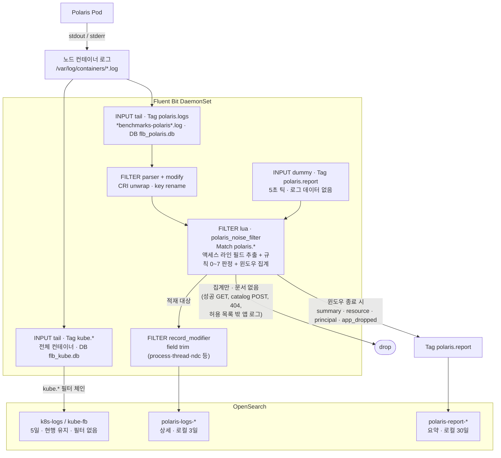

# Polaris Audit Log 적재 — 운영 명세

> **2026-09-21: 이 문서의 이름이 바뀌었다.** `PROPOSAL-polaris-audit-log-retention.ko.md` 였다.
> 제안서가 아니라 **돌고 있는 시스템의 명세**이고 (§10 의 단계는 대부분 완료), 보관(retention)은 §5.3
> 한 절일 뿐 문서 전체의 주제가 아니다. 이전 이름으로 걸린 링크는 저장소 안에서 모두 갱신했다.

**무엇인가** — Polaris 의 장애 대응과 감사를 위해, 무엇을 남기고 무엇을 세기만 할지 정하고 그것을
Fluent Bit Lua 필터로 구현한 시스템의 명세. 모든 로그를 오래 두는 것이 아니라 **클라이언트 행동 추이와
이슈 추적에 필요한 것만** 남긴다. 2026-09-16 부터 로컬 클러스터에서 실제로 돌고 있으며, 아래의 값들은
의도가 아니라 **롤·검증된 상태**다 — 단, 설정을 확인할 때는 이 파일이 아니라 **돌고 있는 객체**를 본다.

**결정 사항**

- 상세 로그와 요약 로그를 **Polaris 전용 인덱스 2개**(`polaris-logs-*` / `polaris-report-*`)로 분리해
  적재한다. 인덱스를 2개 만들 수 없는 환경이면 **1개로 합친다** (§5.4).
- 상세 로그는 **오류(404 제외)·변경·인증 실패 전건**과 **허용 목록의 애플리케이션 로그**만 남긴다.
  성공한 조회, 데이터 플레인 POST, **404** 는 **세기만** 한다 (404 는 v5, §3.9).
- 요약은 **1시간** 윈도우 단위로 리소스·principal 별 행을 남긴다 (2026-09-21 결정, 아래).

| 항목 | 값 |
|---|---|
| 대상 | Polaris **1.6.0** (`benchmarks-polaris`, namespace `datahub-hynix`). 1.6.0 은 2026-09-18 에 올렸고 콘솔 출력은 여전히 JSON 이라 tier 2 파싱은 그대로다. 복수형 `event-listener.types` 가 동작한다 |
| 적재 방식 | Fluent Bit DaemonSet + Lua 필터 → OpenSearch 3.5.0 |
| 인덱스 | `polaris-logs-YYYY.MM.DD` (상세) · `polaris-report-YYYY.MM.DD` (요약) |
| 보관 기간 | **로컬 클러스터 적용값 — 상세 `polaris-logs-*` 3일 · 요약 `polaris-report-*` 30일 · 공용 `k8s-logs-*` 3일** (Kade 2026-09-18, §5.3). 설계 권장값은 상세 30일 · 요약 365일이었다. **ISM 파일은 이 저장소가 보유하고**(`logging/opensearch/ism-*.json`), `step13-ism-apply.sh` 로 **2026-09-18T08:45Z 적용 완료 — 정책 3개, 인덱스 5개 관리 중이며 실제로 평가되고 있다**(`_ism/explain` 이 `attempt_transition_step`/`condition_not_met`). 첫 삭제는 **2026-09-20 08:42Z** (`k8s-logs-2026.09.17`) |
| 요약 주기 | **1시간 (`WINDOW_SECONDS` 3600) — 2026-09-21 결정 (매니저).** 이전 설계값 30분(1800)을 대체한다. **배포 후 모니터링하면서 다시 조정할 수 있는 값이고, 후보는 1시간과 2시간이다.** 현재 돌고 있는 값은 아직 **30초** (2026-09-16 검증용) — 롤은 Lua 변경이라 `apply-lua.sh` 가 필요하다 (§10.1-7, §11-4) |
| 필터 정책 | **정책 v5 / 리포트 스키마 v6** — 2026-09-16 적용·검증 (Lua 리팩터, 필드 이름 `message`, 리포트 봉투 정리, 파이프라인 재검토 반영). **2026-09-18: 상세 인덱스의 `threadName`/`threadId` 복원** (values 만 변경, Lua sha 불변 — `#42`) |
| 문서 상태 | 로컬 환경(OrbStack) 적용 · **v5 롤·검증 (2026-09-16)** (404 집계, Lua ConfigMap, hot reload 없음) · **Lua 리팩터 롤·검증** (Lua FILTER 2개 → 1개) · **스키마 v6 롤·검증** · **`threadName`/`threadId` 복원 롤·검증 (2026-09-18, `#42`)** · **ISM 적용·평가 중 (2026-09-18)** · **2026-09-21 트래픽으로 재검증** (상세 391건, 요약 122행, 불변식 7개 통과). 남은 단계는 §10 |

### 현재 상태와 목표

| 항목 | 목표 | 현재 (2026-09-21) |
|---|---|---|
| 필터 정책 | v5 | **v5 적용됨**, 리포트 스키마 **v6**. 2026-09-21 확인 파드는 `benchmarks-fluent-bit-pdr2h` (09-16 의 `62klp` 는 그 뒤로 여러 번 교체됐다 — 파드 이름은 기록이지 상태가 아니다) |
| 인덱스 구성 | 2개 (불가 시 1개) | 2개 — `polaris-logs-*` / `polaris-report-*` |
| 인덱스 템플릿 | 적용 | **적용됨** (2026-09-16, 요약·상세 모두). v6 매핑(문자열은 `.keyword` 로 조회)은 템플릿 재적용 이후 새로 생기는 인덱스부터 |
| ISM 보관 정책 | 상세 3일 · 요약 30일 · 공용 3일 (로컬) | **적용됨·평가 중 (2026-09-18T08:45Z)** — 정책 3개 저장, 인덱스 5개 관리, 첫 삭제 2026-09-20 08:42Z. 2026-09-16 의 "모니터링팀 담당" 은 **로컬 클러스터에 한해 철회**되었다 (운영은 그대로) |
| 요약 윈도우 | **3600초 (1시간)** — 2026-09-21 결정 | **30초.** 2026-09-16 에 내린 "임시" 값이 그대로다. 09-21 의 30개 윈도우 중 28개가 트래픽 0 인 summary 행이었다 |
| 404 처리 | 집계만 (§3.9) | **적용·검증됨** — 2026-09-21 재확인: 404 **99건 집계, 적재 0건**, 딸린 앱 로그 109건도 `app_dropped_404` 로 |
| Lua 배포 | ConfigMap, 시작 시 로드 (§9.1) | **적용됨** (2026-09-16, hot reload 없음). Lua 와 config 를 함께 바꿀 때는 §9.1 위험 3 의 순서 |

### 버전 이력

| 버전 | 날짜 | 변경 |
|---|---|---|
| v2 | 2026-09-07 | 요약 스키마 정리 (`counted_read`, 활성 행만 집계) |
| v3 | 2026-09-09 | `last_read_bytes` / `last_write_bytes`, `api_kind`, grant 를 롤 행으로 접기 |
| **v4** | **2026-09-15** | 애플리케이션 로그 허용 목록, `app_dropped`, 테이블 커밋 시간 `commit_ms_*`, 요청 0 행 제거, 자격증명 가드 |
| v5 | 2026-09-16 (롤, 검증) | **404 집계만** + 같은 `requestId` 의 앱 로그 폐기 (`counted_404`, `app_dropped_404`, `held_orphans`, `held_pending`), `/namespaces/{ns}/register` 분류, Lua 를 별도 ConfigMap 으로 배포 (hot reload 없음, 재시작으로 반영) |
| v6 | 2026-09-16 (롤, 검증) | 정책 동일. 원문 필드 이름 `_msg` → **`message`** (상세·요약), 리포트 봉투에서 `app`/`level` 제거, 문장은 summary 행에만. 파이프라인: 저장 안 할 필드를 Lua 앞에서 제거, `flb_tag`·`stream`·`app` 상수 필드 제거, tier 1 의 죽은 출력·자기 로그 수집·빈 파서 필터 제거, 템플릿의 문자열을 `.keyword` 전용으로 (`logging/REVIEW-pipeline-2026-09-16.md` P1–P8) |
| v5 리팩터 | 2026-09-16 (롤, 검증) | **스키마·정책 동일.** 액세스 라인 파싱을 판정 필터에 통합 (Lua FILTER 2개 → 1개), 리소스 분류 가속, 기동 직후 첫 틱 이전 레코드도 집계 (그 윈도우는 `partial_window: "true"`). 상세 인덱스에서 `threadName`·`threadId`·`ndc` 제거 — **`threadName`/`threadId` 는 2026-09-18 에 되돌렸다 (아래).** 리팩터 전후 같은 트래픽의 요약 수치 동일 |
| 필드 복원 | 2026-09-18 (롤, 검증) | **스키마·정책 동일** (리포트 스키마는 v6 그대로, Lua sha 불변 — values 만 바꿨다). 상세 인덱스에 **`threadName`·`threadId` 복원**, `ndc` 는 계속 제거. 09-16 의 제거(`#30`)를 뒤집은 것으로, 이유는 요청을 가로지르는 상관 키가 `threadName` 말고 없었기 때문. **비용 문서당 약 47 B** (수용, 실측 아님). 검증: 367/367 문서가 두 필드를 갖고 `ndc` 0건. **조회는 반드시 `threadName.keyword`** (`#42`) |
| 윈도우 1시간 | 2026-09-21 (결정, 미적용) | **`WINDOW_SECONDS` 운영값을 1800 → 3600 으로 정했다 (매니저 결정).** 이전 문서가 말하던 "1800 으로 복귀" 는 더 이상 목표가 아니다. **배포 후 모니터링하며 재조정할 수 있고 후보는 1시간·2시간이다.** 정책·스키마는 바뀌지 않는다 — 윈도우 길이만 바뀌며, 영향은 행 상한(§11-21)과 검증 비용(윈도우 하나에 1시간)이다. 롤은 Lua 변경이므로 `apply-lua.sh` |
| 재검증 | 2026-09-21 | 변경 없음. 바뀐 테스트 트래픽(의도적 500 프로브, 거부 principal)으로 파이프라인을 다시 확인: 상세 391건 / 요약 122행, 불변식 7개 통과, 391/391 이 `threadName`·`threadId` 보유. 샘플은 `GUIDE-sample-data-2026-09-21.ko.md` |

---

## 1. 현황과 문제

OpenSearch 에서는 모든 서비스의 로그를 하나의 공용 인덱스(운영 `kube-fb`, 로컬 `k8s-logs`)에 적재하고
있다. 이 인덱스는 용량이 커서 보관 기간을 늘릴 수 없고, **보관 기간은 인덱스 단위로 정해지므로 Polaris
만 길게 두는 것도 불가능하다.**

| 문제 | 영향 |
|---|---|
| 보관 5일 | 5일이 지난 장애는 로그가 남아 있지 않아 원인 추적 불가 |
| 전 서비스 공용 인덱스 | Polaris 만 보관 기간을 늘릴 수 없음 |
| 전량 적재 | 액세스 로그 **하루 5,000만 건** 대부분이 성공한 GET. 감사 가치는 낮고 용량은 대부분을 차지 |
| 애플리케이션 로그 | 요청마다 반복되는 초기화·속성 로그가 원인 분석에 필요한 로그와 섞여 있음 |

### 1.1 운영 트래픽 프로파일

설계와 용량 산정의 기준값이다.

| 항목 | 일일 건수 | 비고 |
|---|---:|---|
| 액세스 로그 전체 | **약 50,000,000** | |
| └ GET | 대부분 | 성공한 조회는 요약에만 남는다 (규칙 6) |
| └ POST | GET 다음 | catalog POST 는 요약에만, management POST 는 전건 적재 (규칙 5) |
| └ PUT + DELETE | **약 5,000 ~ 6,000** | 전건 적재 (규칙 4) — 권한·신원 변경의 대부분이 여기에 속한다 |
| 404 응답 | **약 400,000** | 현재 전건 적재. **장기 보관 부적합** — 처리 방식은 §3.9 |

### 1.2 요구사항

- **클라이언트 행동 추이** — 누가, 어떤 리소스에, 얼마나 읽고 쓰는지를 1시간 단위로 본다.
- **이슈 추적** — 무엇이 실패했는지(액세스 로그)와 왜 실패했는지(예외 로그)를 요청 단위로 짝지어 본다.
- 이 두 가지에 쓰이지 않는 로그는 저장하지 않는다. 단, **버린 것은 반드시 개수로 남긴다** (§2 핵심 원칙).

---

## 2. 설계 요약

> 편집 가능한 원본: [`logging/polaris-logging.drawio`](polaris-logging.drawio) (draw.io) — v4·v5 반영 필요



읽을 때 놓치기 쉬운 세 가지를 짚어둔다.

**① 같은 파일을 두 INPUT 이 각자 읽는다.** `kube.*` 는 전체 컨테이너를, `polaris.logs` 는 Polaris 컨테이너만
tail 한다. 오프셋 DB 는 반드시 분리한다(`flb_kube.db` / `flb_polaris.db`). 공유하면 양쪽 오프셋이 모두 깨진다.
이 설계는 기존 파이프라인의 **교체가 아니라 추가**다 — Polaris 로그는 공용 인덱스에도 필터 없이 계속
들어간다. 요약이 원본과 맞는지 검증할 수단이 그것뿐이기 때문이다. 중복 적재 제거는 **별도 결정 사항**이다.

**② 요약은 로그 스트림에서 나오지 않는다.** 요약 문서를 만드는 것은 **5초마다 도는 빈 틱** (`dummy` INPUT)
이다. 틱이 윈도우 경계를 넘었을 때만 요약으로 치환되고 나머지는 버려진다. 따라서 **요약 문서의 시각은
로그가 아니라 틱이 결정**하며, 경계와 틱 사이(0 ~ 5초)에 들어온 요청은 직전 윈도우에 집계된다 (§4.6-7).

**③ Lua 는 한 파일, 한 FILTER 다.** `fluent-bit/polaris_access_log.lua` 의 함수 `polaris_noise_filter` 하나가
액세스 라인 파싱 → 판정 → 집계 → 요약을 모두 한다 (2026-09-16 리팩터 전에는 파싱 함수 `polaris_access_log` 가 별도
FILTER 였다. Lua FILTER 는 레코드마다 전체를 Lua 테이블로 변환하므로 하나로 합쳤다). 이 필터가 `polaris.*` 를 매치해야
틱이 같은 필터 인스턴스(= 같은 카운터)를 지난다.

> **핵심 원칙 — 버리는 것이 아니라 세는 것.** 적재하지 않은 액세스 라인은 리소스·principal 행의 카운터에,
> 적재하지 않은 애플리케이션 로그는 `app_dropped` 행에 반드시 반영된다. "기록이 없다" 는 "요청이 없었다" 가
> 아니라 "요약에서 집계되었다" 는 뜻이다.

---

## 3. 적재 로그

### 3.1 [INFO] Access Log — 오류·변경 요청

클라이언트가 어떤 리소스에 언제 접근했고 실패했는지를 보여준다. 2xx 조회와 catalog POST 는 요약에만 남는다.

```
192.168.194.1 - root [14/Sep/2026:07:29:31 +0000] "PUT /api/management/v1/catalogs/nb1789370776stale HTTP/1.1" 409 132
192.168.194.1 - mx_1789370776_runner [14/Sep/2026:07:27:30 +0000] "POST /api/catalog/v1/apimatrix1789370776_cat/views/rename HTTP/1.1" 500 168
```

액세스 라인은 적재 시 다음 필드로 파싱되어, 원문 검색 없이 조건 검색이 가능하다.

| 필드 | 예시 | 용도 |
|---|---|---|
| `client_ip` | `192.168.194.1` | 호출 출처 |
| `user_principal_name` | `root`, `-` | 호출 주체. **`-` 는 미인증 또는 인증 실패**이며 결측이 아니다 |
| `http_method` | `PUT` | 읽기/쓰기 구분 |
| `api_path` | `/api/management/v1/catalogs/...` | 원본 경로 (쿼리스트링 포함) |
| `http_status` | `409` | 숫자형. 범위 검색 가능 |
| `response_size` | `132` | 숫자형. CLF 의 `-` 는 0 |
| `mdc.requestId` | `bbe6f50a-…_…043` | **요청 ID. 같은 요청의 예외·권한 로그와 조인하는 키** (§3.2, §3.3) |
| `access_log_parse_error` | `true` | 파싱 실패 시에만 존재. **로그 패턴 변경 감지용** |
| `message` | 위 원문 라인 | **원문 그대로 보존** (결정: Kade 2026-09-16). 스키마 v6 부터 이름이 `message` (이전 `_msg`) |

### 3.2 [INFO] Runtime Exception — "왜 실패했나"

```
Handling runtimeException TopLevelEntity of type PRINCIPAL_ROLE does not exist: mx_1789370776_prole_doomed
```

logger `org.apache.polaris.service.exception.IcebergExceptionMapper`. 액세스 로그가 *무엇이* 실패했는지를
보여준다면, 이 로그는 *왜* 실패했는지를 보여준다. **`mdc.requestId` 로 액세스 문서와 조인**한다
(2026-09-15 측정: 적재된 예외 로그 180건 전부 조인됨). 5xx 의 경우 같은 logger 의 ERROR 레벨 문서에
`exception.exceptionType` / `exception.message` 가 붙는다.

### 3.3 [INFO] 권한·신원 변경 — "누가 무엇을 바꿨나"

```
Adding grant class AddGrantRequest {
    grant: class CatalogGrant {
        class GrantResource { type: catalog }
        privilege: TABLE_READ_DATA
    }
} to catalogRole mx_1789370776_crole in catalog apimatrix1789370776_cat
```

logger `org.apache.polaris.service.admin.PolarisServiceImpl`. 관측된 메시지: `Adding grant`, `Revoking grant`,
`Created new catalog / principal / principalRole / catalogRole`, `Assigning / Revoking … Role`.

- 메시지에는 **부여 대상은 있지만 호출자는 없다.** 호출자는 `mdc.requestId` 로 조인한 액세스 문서의
  `user_principal_name` 에서 얻는다 (측정: 75건 전부 조인됨).
- **삭제·수정은 이 logger 가 남기지 않는다** (DELETE 25건에 대응 로그 0건). 삭제 감사는 액세스 로그
  (규칙 4) 가 담당하므로, 규칙 4 는 이 정책에서 빼면 안 된다.
- 여러 줄에 걸친 로그이므로 수집 단계 multiline 병합이 깨지면 한 건이 여러 문서로 쪼개진다 (§11).

### 3.4 WARN / ERROR

WARN / ERROR 는 **logger 와 무관하게 전부 적재**한다. 허용 목록 방식의 약점은 "모르는 logger" 이고, 모르는
logger 의 경고야말로 이슈 추적이 놓치면 안 되는 것이다. WARN/ERROR 는 용량 문제가 아니다.

> `[WARN] deprecated config` 는 `polaris/values.yaml` 의 `io.quarkus.config: "OFF"` 로 애초에 출력되지
> 않는다 (2026-09-04 측정 0건). 따로 제외 규칙을 두지 않는다.

### 3.5 적재 판정 규칙 (정책 v5)

**위에서부터 평가하며, 먼저 일치한 규칙이 이긴다.**

| 순서 | 조건 | 처리 |
|---|---|---|
| 0 | 리포트 틱 (Tag `polaris.report`) | 윈도우가 넘어가면 요약으로 치환, 아니면 버림 |
| * | 모든 레코드 | 마스킹되지 않은 `clientSecret` 을 `<redacted>` 로 치환 (§3.8) |
| 1 | level 이 `ERROR` 또는 `WARN` | **적재** |
| 2a | `Successfully committed to table\|view … in N ms` | 해당 table/view 행에 **커밋 시간 집계** 후 2b/2c 로 계속 |
| 2b | 액세스 로그가 아닌 레코드 & logger 가 **허용 목록**에 있음 | **적재** — 단 `mdc.requestId` 가 있으면 같은 ID 의 액세스 라인까지 **보류**, 그 요청이 404 면 함께 버림 (v5, §3.9) |
| 2c | 액세스 로그가 아닌 그 외 레코드 | logger 별로 **세고 버림** (`app_dropped`) |
| — | *모든 액세스 라인은 여기서 리소스·principal 행에 먼저 집계된다* | |
| 3′ | `http_status == 404` (파싱 성공) | **집계만** — `errors_4xx` 와 `counted_404` (v5, §3.9) |
| 3 | `http_status >= 400` 또는 파싱 실패 | **적재 — 전건, 상한 없음** |
| 4 | `PUT` / `DELETE` / `PATCH` | **적재 — 전건** |
| 5 | `/api/management/` 하위 `POST` | **적재 — 전건** |
| 5' | 그 외 경로 `POST` | 집계만 |
| 6 | `GET` / `HEAD` 이고 2xx | 집계만 |
| 7 | 그 외 | 적재 |

보장하는 것:

- **인증·인가 실패 100% 보존** — 모든 401·403 은 규칙 3 으로 전문 문서가 남는다. (404 는 개수만 — §3.9)
- **신원·권한 변경 100% 보존** — management POST, 모든 PUT·DELETE (규칙 4·5) + 변경 내용 (§3.3).
- **총량 보존** — 버린 것은 전부 카운터에 있다.

규칙 5 의 management / catalog 분리 이유: Polaris 에서 **POST 는 생성 동사**다 (`create_principal`,
`create_principal_role`, `create_catalog_role`, `reset_principal_credentials`). POST 를 통째로 집계만 하면
principal 이 **생성될 때는 안 보이고 삭제될 때만 보이는** 감사 비대칭이 생긴다. 반대로 catalog POST
(`create_table`, `commit_table`, rename, `report_metrics`, `oauth/tokens`)는 데이터 플레인 반복 트래픽이다.

### 3.6 애플리케이션 로그 허용 목록

| logger | 판정 | 측정 건수* | 내용 |
|---|---|---:|---|
| `…service.exception.IcebergExceptionMapper` | **적재** | 180 | 4xx/5xx 의 이유 (§3.2) |
| `…service.admin.PolarisServiceImpl` | **적재** | 75 | grant·create·assign (§3.3) |
| `…catalog.iceberg.IcebergCatalogHandler` | 버림 | 61 | `Initializing non-federated catalog` — 거의 매 요청 |
| `org.apache.iceberg.BaseMetastoreCatalog` | 버림 | 37 | `Table properties set/enforced …: {}` |
| `org.apache.iceberg.CatalogUtil` | 버림 | 30 | `Loading custom FileIO implementation` |
| `…catalog.iceberg.IcebergCatalog` | 버림 (커밋 시간은 수확) | 24 | `Refreshing table …`, `Successfully committed …` |
| `org.apache.iceberg.view.BaseMetastoreViewCatalog` | 버림 | 6 | `View properties set/enforced …: {}` |
| `…config.PolarisIcebergObjectMapperCustomizer` | 버림 | 3 | `Limiting request body size` (기동 시) |
| DEBUG 레벨 전체 (SQL 등) | 버림 | — | 허용 목록 밖 |

\* 2026-09-15 API 매트릭스 테스트 1회 (액세스 343건). 운영 트래픽 비율이 아니다.

**logger 단위로 허용하는 이유** — 메시지 접두어 목록으로 허용하면, Polaris 업그레이드로 새 메시지
(`Updating …` 등)가 생겼을 때 조용히 버려진다. 허용한 두 logger 는 본질적으로 요청당 0~1줄이라 logger
단위로 전부 받아도 양이 적다.

**허용 목록 변경 절차** — §9.4.

### 3.7 미적재 대상과 대체 수단

문서는 남지 않지만 **모두 요약에 반영**된다.

| 대상 | 이유 | 대체 수단 |
|---|---|---|
| 2xx `GET` / `HEAD` | 하루 수천만 건의 정상 조회 | `reads`, `last_read_bytes` |
| 2xx catalog `POST` (`create_table`, `commit_table`, `report_metrics`, `oauth/tokens` 등) | 데이터 플레인 반복 트래픽 | `writes`, `counted_post`, `last_write_bytes`, `commit_ms_*` |
| 허용 목록 밖 애플리케이션 로그 | 추이·이슈 추적에 쓰이지 않음 | `app_dropped` 행 (logger 별 개수) |
| **404 액세스 라인과 그 요청의 허용 목록 앱 로그** (v5) | 하루 약 40만 건, 상세 용량의 약 98% | `errors_4xx` (리소스·principal 행), `counted_404` · `app_dropped_404` (summary) |

### 3.8 자격증명 가드

`Created new principal` 로그는 `PrincipalWithCredentials` 를 통째로 출력하며 `clientSecret` 을 포함한다.
현재 Polaris 는 이 값을 `*` 로 마스킹한다 (2026-09-15 측정 4건 모두 `*`). **그 마스킹이 회귀하면 평문
시크릿이 30일 인덱스에 들어가므로** Lua 에서 한 번 더 막는다 — `*` 가 아닌 값은 `<redacted>` 로 바꾸고
`secret_redacted: true` 를 붙인다. `secret_redacted:true` 문서가 하나라도 생기면 Polaris 측 회귀다.

### 3.9 404 응답 처리 (정책 v5)

**결정 (2026-09-16)** — 404 는 **적재하지 않고 집계만** 한다. 그 요청이 남긴 애플리케이션 로그(예외 사유 등)도
함께 버리며, 같은 요청인지는 **`mdc.requestId`** 로 판단한다. *v5 로 적용·검증 (2026-09-16): 윈도우당 404 100건 집계, 적재 0건, 같은 요청의 앱 로그 110건 폐기.*

| 배경 사실 | 값 |
|---|---|
| 일일 404 건수 (운영) | **약 400,000** |
| v4 처리 | 규칙 3 에 의해 **전건 적재** (액세스 문서 + 예외 로그) |
| 상세 인덱스 용량 중 비중 | **약 98%** — 알려진 항목 기준 (§6.2) |
| 예외 로그 동반율 | 2026-09-16 매트릭스 윈도우에서 404 마다 `IcebergExceptionMapper` 1줄 (비율 1.0) |

**처리**

| 대상 | v5 처리 | 남는 숫자 |
|---|---|---|
| 404 액세스 라인 (파싱 성공) | 집계만 (규칙 3′) | 리소스·principal 행 `errors`, `errors_4xx` · summary `counted_404`, `access_counted` |
| 그 요청의 허용 목록 INFO 로그 | 버림 | summary `app_dropped_404` |
| 그 요청의 WARN / ERROR | **적재** (규칙 1 이 먼저) | — |
| 허용 목록 밖 로그 | 기존대로 세고 버림 | `app_dropped` 행 |
| 404 가 아닌 요청의 허용 목록 로그 | 적재 (v4 와 같음) | — |

**요청 ID 보류 — 왜 필요한가.** Polaris 는 예외 사유·grant 로그를 액세스 라인보다 **먼저** 쓴다 (2026-09-16
실측: 앱 로그 210건 중 207건이 앞, 간격 최대 11 ms). 앱 로그를 보는 순간에는 응답 코드를 모른다. 그래서:

1. 허용 목록 INFO 로그에 `mdc.requestId` 가 있으면 필터 메모리에 **보류**한다.
2. 같은 ID 의 액세스 라인이 오면 — 404 면 보류분을 버리고, 아니면 액세스 라인과 **함께** 내보낸다.
3. 액세스 라인보다 **늦게** 온 앱 로그는, 최근 30초(`STATUS_MEMO_SECONDS`, 최대 20,000 ID) 동안 기억한 상태로
   즉시 판정한다 (실측 3건, 같은 ID 재사용).
4. `requestId` 가 없으면 보류하지 않고 **즉시 적재**한다 (v4 동작).
5. 30초(`HOLD_MAX_SECONDS`) 안에 짝을 못 찾거나 보류가 10,000건을 넘으면 `held_orphan: true` 를 붙여
   **적재**한다 — 판단할 수 없는 것은 버리지 않는다. summary `held_orphans` 로 센다.
6. 고아는 다음 `polaris.logs` 레코드와 함께 나간다 (틱의 반환은 요약 인덱스로 가므로 틱에서는 내보내지
   않는다). 윈도우 종료 시점의 보류 건수는 summary `held_pending`.

**잃는 것과 주의점**

- **404 의 경로·주체 원문과 예외 사유.** 존재하지 않는 리소스의 404 는 `__errors__` 행 개수와 principal 행으로만
  남는다 (§4.6-4). "무엇을 찾다가 404 가 났나" 는 5일 공용 인덱스(`k8s-logs`)에서만 볼 수 있다.
- **`@timestamp` 이동.** 여러 레코드를 한 번에 반환하면 Fluent Bit 은 타임스탬프를 하나만 쓴다. 보류분의
  `@timestamp` 는 함께 나간 레코드(보통 같은 요청의 액세스 라인, 수 ms 뒤; 고아는 30초 이상 뒤)의 시각이 된다.
  원래 시각은 `_time` 에 그대로 있다.
- **파드 재시작 시 보류분 소실** — 메모리 상태이므로 최대 30초치 허용 목록 로그 (§9.1).
- **운영 전 확인 필요** — 클라이언트가 요청 ID 헤더를 보내지 않을 때 Polaris 가 `requestId` 를 붙이는지
  **미측정**이다 (로컬 테스트 트래픽은 전부 ID 보유). 붙이지 않으면 그 404 의 앱 로그는 보류 없이 적재된다.
  안전한 방향(용량만 증가)이지만 §6.2 절감 폭이 줄어든다.
- **완결성 불변식은 그대로다.** `access_seen - access_counted == access_kept` — 404 는 `access_counted` 에 들어간다.

**검증 방법** — v5 롤 후 같은 윈도우를 `step11-replay-window.py` 로 공용 인덱스 원본에서 재생해 요약 행과
상세 문서 수(logger 별)가 예측과 같은지 본다. 2026-09-16 윈도우 기준 예측: 상세 300 / 32 / 178 → **200 / 22 / 78**
(액세스 / PolarisServiceImpl / IcebergExceptionMapper).

---

## 4. 로그 요약

요약은 윈도우(운영 1시간) 단위로, 그 기간의 요청을 리소스·principal 별로 합쳐 전송한다. 같은 요청이 1,000번
와도 문서는 한 줄이다.

네 종류(`report_type`)가 **같은 윈도우 식별자(`window_start`)** 를 공유하므로 `window_start` 로 묶으면 한
윈도우 전체가 한 화면이 된다. 모든 쿼리는 **`schema_version` 으로 필터**한다 (버전이 한 인덱스에 공존).

### 4.1 전체 요약 (`report_type: summary`)

```
polaris shipper report seq=4@benchmarks-fluent-bit-rvm49 2026-09-15T09:19:30Z..2026-09-15T09:20:00Z: 76 access lines, 39 kept, 37 counted (30 read, 7 POST), 0 errors kept (0 4xx, 0 5xx, 0 denied), 15 resources, 3 principals, 21 app lines dropped, 202348 bytes, 0 windows skipped
```

윈도우당 정확히 1건. **대시보드에서는 제외하고**(`NOT report_type:summary`) **완결성 검증에만** 쓴다 —
"리소스 행 합계 = principal 행 합계 = 본 액세스 라인 수" 불변식과 상한 초과·틱 누락 카운터가 여기에만 있다.

### 4.2 리소스 요약 (`report_type: resource`)

> **v6 부터** resource / principal / app_dropped 행에는 아래와 같은 문장이 없다 — 같은 문서의 숫자 필드를 되풀이할 뿐이라
> 제거했다 (리포트 용량의 약 25%). 문장은 summary 행의 `message` 에만 남는다. 아래 예시는 필드 값을 읽는 법으로 본다.

```
seq=4 resource /api/management/v1/catalogs/apimatrix1789463971_cat/catalog-roles/apimatrix1789463971_shared (management/catalog-role): 50 requests, 25 reads, 25 writes, 0 errors (0 4xx, 0 5xx, 0 denied), 16205 bytes, last read 1254, last write -
seq=4 resource /api/catalog/v1/apimatrix1789463971_cat/namespaces/probe_ns/tables/probe_tbl (catalog/table): 0 requests, 0 reads, 0 writes, 0 errors (0 4xx, 0 5xx, 0 denied), 0 bytes, commits 1 (min/avg/max 57/57/57 ms)
```

- **키는 URL 이 아니라 리소스다.** `/tables/t/metrics` 와 `/tables/t` 는 같은 테이블 행이다.
  `resource_kind`: `table` / `view` / `namespace` / `collection` / `catalog` / `catalog-role` /
  `principal-role` / `principal` / `auth` / `config` / `transaction` / `error` / `other`.
  API 면은 `api_kind`: `catalog` / `management` / `mixed`.
- **권한 부여는 롤 행으로 접힌다.** `/catalog-roles/{cr}/grants` 는 `{cr}` 행에 집계되므로 그 행의
  `writes` 가 곧 부여 건수다 (측정: `_shared` 롤 25 writes = `Adding grant` 25건).
- **커밋 시간 (v4).** table/view 행에 `commit_count`, `commit_ms_sum`, `commit_ms_min`, `commit_ms_max`.
  출처는 `IcebergCatalog` 의 `Successfully committed to table|view <id> in N ms` 이며, 메시지의 식별자
  (`catalog.ns.table`)를 URL 키로 바꿔 붙인다 (다단계 네임스페이스는 `%1F` 로 연결).
  - **요청 지연이 아니라 Iceberg 커밋 시간이다** (메타데이터 파일 쓰기 + 메타스토어 갱신). 인증·파싱·응답은
    포함되지 않는다.
  - **성공한 커밋만** 집계된다. 실패한 커밋은 로그가 없다.
  - **요청 0 + 커밋 N 행**이 정상적으로 생긴다: 테이블·뷰 **생성**(요청은 `…/tables` 컬렉션 행, 커밋은
    새 테이블 행)과 **트랜잭션 커밋**(요청은 `/transactions/commit` 행, 커밋은 각 테이블 행).

### 4.3 Principal 요약 (`report_type: principal`)

```
seq=4 principal root: 73 requests, 28 reads, 45 writes, 0 errors (0 4xx, 0 5xx, 0 denied), 22215 bytes
```

클라이언트별 요청 추이. 비정상적인 요청 급증과 인증 거부(`auth_denied`) 급증을 여기서 본다.

### 4.4 버린 애플리케이션 로그 (`report_type: app_dropped`, v4)

```
seq=4 app_dropped org.apache.polaris.service.catalog.iceberg.IcebergCatalogHandler: 7 lines
```

허용 목록 밖이라 버린 로그를 logger 별로 센 행이다 (개수 > 0 인 logger 만). 추이가 아니라 **허용 목록의
헬스 신호**다 — 처음 보는 `org.apache.polaris.service.*` logger 가 나타나면 Polaris 가 새 로그를 내기
시작했다는 뜻이고, 허용 목록 검토 대상이다 (§7.5).

### 4.5 스키마 필드 정의 (v6 — v5 와의 차이는 봉투와 문장 필드뿐)

**공통 봉투** — 네 종류 모두.

| 필드 | 타입 | 설명 |
|---|---|---|
| ~~`app`~~ | string | **v6 에서 제거.** v5 까지 `polaris-shipper-report` |
| ~~`level`~~ | string | **v6 에서 제거.** v5 까지 항상 `REPORT`. 리포트 문서 판별은 `report_type` 으로 |
| `schema_version` | int | **6** (v5 롤 중에는 5). 항상 필터에 포함 |
| `report_type` | string | `summary` / `resource` / `principal` / `app_dropped` |
| `report_seq` | int | **파드 단위** 일련번호. 파드 교체 시 리셋 → `hostname` 과 함께 사용 |
| `hostname` | string | Fluent Bit 파드명 (Polaris 파드 아님) |
| `window_start` / `window_end` | date | RFC3339, 윈도우 그리드에 정렬 |
| `window_seconds` | int | **3600 (운영, 2026-09-21 결정)** / 30 (검증). **값을 문서에서 가정하지 말고 행에서 읽을 것** — 조정 가능한 값이다 |

**`summary`**

| 필드 | 의미 |
|---|---|
| `access_seen` | 필터가 본 액세스 라인 수 (판정 이전) |
| `access_kept` / `access_counted` | 적재된 수 / 집계만 된 수 |
| `counted_read` / `counted_post` | 집계분의 규칙 6 / 규칙 5' 분해 |
| `errors_kept`, `errors_4xx`, `errors_5xx`, `auth_denied` | 오류 계열 |
| `parse_errors` | 액세스 로그로 인식됐으나 파싱 실패 |
| `distinct_resources` / `distinct_principals` | 요청 > 0 인 행 수 (커밋만 있는 행 제외) |
| `app_dropped_total` | **v4.** 버린 애플리케이션 로그 수 (허용 목록 밖) |
| `counted_404` | **v5.** 집계만 한 404 액세스 라인 수 (`access_counted` 에 포함) |
| `app_dropped_404` | **v5.** 404 요청이라 버린 허용 목록 앱 로그 수 (`app_dropped_total` 에 **불포함**) |
| `held_orphans` | **v5.** 짝을 못 찾아 `held_orphan: true` 로 적재된 앱 로그 수 |
| `held_pending` | **v5.** 윈도우 종료 시점에 보류 중인 앱 로그 수 (다음 윈도우로 넘어감) |
| `resources_other` / `resources_other_distinct` / `principals_other` | 행 상한(리소스 500 / principal 200) 초과분 |
| `role_keys_forced` | 오류 요청이 강제로 만든 롤 행 수 (100 = 상한 도달) |
| `windows_skipped` | 틱 누락으로 열리지 못한 윈도우 수 |
| `message` | **v6.** 사람이 읽는 윈도우 요약 문장 (v5 까지 `_msg`, 모든 행에 있었음) |
| `min_record_time` / `max_record_time` | 윈도우 레코드의 최소/최대 시각. 트래픽 없으면 **필드 없음** |
| ~~`carried_rows`~~ | **v4 에서 삭제** |

**`resource` / `principal`**

| 필드 | 의미 |
|---|---|
| `resource` / `user_principal_name` | 집계 키 |
| `resource_kind`, `api_kind` | 분류 (principal 행에는 없음) |
| `requests`, `reads`, `writes`, `errors` | reads = GET·HEAD, writes = POST·PUT·DELETE·PATCH, errors = status ≥ 400 |
| `errors_4xx`, `errors_5xx`, `auth_denied` | 오류 분해 |
| `response_bytes` | 윈도우 합계 |
| `last_read_bytes` / `last_write_bytes` | 윈도우 내 마지막 2xx·크기 > 0 인 읽기/쓰기 크기. **없으면 필드 없음** |
| `commit_count`, `commit_ms_sum`, `commit_ms_min`, `commit_ms_max` | **v4.** table/view 행만. 커밋 없으면 필드 없음 |

**`app_dropped`** — `logger_name` (string), `dropped` (int).

### 4.6 해석 시 주의 (대시보드 작성 전 필독)

1. **카운터는 의도적으로 겹친다.** `errors` 는 `reads`/`writes` 와, `errors_4xx + errors_5xx` 는 `errors` 와
   겹치고, `auth_denied`(401·403)는 `errors_4xx` 의 부분집합이다. **이 컬럼들을 더하면 틀린다.**
2. **부재는 0 이 아니다.** `last_write_bytes`, `commit_*`, `min_record_time` 이 없다는 것은 "표본이 없었다"
   는 뜻이다.
3. **`-` 는 실재하는 주체다.** 미인증·인증 실패 트래픽이며 결측이 아니다.
4. **`__errors__` 와 `__other__` 는 다르다.** `__other__` 는 행 상한 초과분이다. `__errors__` 는 **그 순간
   행이 없던 리소스의 오류**가 모이는 곳이다 — 같은 윈도우라도 첫 성공 요청 *이전*의 오류는 `__errors__`
   로, *이후*의 오류는 그 리소스 행으로 간다 (2026-09-15 실측). 원본 문서는 규칙 3 으로 남아 있다.
5. **`report_seq` 는 파드 단위다.** `hostname` 없이 연속성을 판단하지 않는다.
6. **요청 0 행은 없다 (v4).** 요청이 0 으로 떨어지면 행 자체가 없어진다. 추이 차트는 **빈 버킷을 0 으로**
   그리도록 설정하고, "호출이 끊긴 클라이언트" 알림은 `requests == 0` 이 아니라 **문서 부재**로 건다.
7. **윈도우 라벨은 틱 위상만큼 밀린다.** 행 `[W, W+1시간)` 은 실제로 `[W+δ, W+1시간+δ)` 를 담는다. δ 는 0~5초
   이며 파드마다 다르고 천천히 드리프트한다 (3.673s → 2.77s, 새 파드 1.765s 실측). 1시간 윈도우에서는 무시할
   만하지만, **경계 직후를 노리는 테스트는 경계 + 6.5초 이후에 시작**해야 한다.
8. **평균은 합으로 계산한다.** 커밋 평균은 `sum(commit_ms_sum) / sum(commit_count)`. 윈도우 평균의 평균은
   틀린다.

---

## 5. 인덱스 설계

### 5.1 인덱스 구성 — 1단계: 2개

| 항목 | 상세 | 요약 |
|---|---|---|
| 이름 | `polaris-logs-YYYY.MM.DD` | `polaris-report-YYYY.MM.DD` |
| 조회 패턴 | `polaris-logs-*` | `polaris-report-*` |
| 내용 | 액세스(오류·변경) + 허용 목록 앱 로그 + WARN/ERROR | summary · resource · principal · app_dropped |
| 보관 | **3일** (로컬 적용값. 설계 권장은 30일) | **30일** (로컬 적용값. 설계 권장은 365일) |
| shard / replica | 1 / 0 (단일 노드) | 1 / 0 |

**2개로 나누는 이유**

- **보관 기간이 다르다.** 요약의 가치는 장기 추이(분기·연간)에 있고 용량이 작다. 상세는 크고 30일이면 충분하다.
- **매핑이 섞이지 않는다.** 두 문서 형태가 한 매핑을 공유하면 첫 문서가 필드 타입을 확정하는 사고 위험이
  커진다 (§5.2).
- 적재 오류가 한쪽에서 나도 다른 쪽은 계속 들어간다 (출력·재시도 버퍼가 분리됨).

### 5.2 인덱스 템플릿 — 선택이 아니라 필수

동적 매핑에 맡기면 **그 인덱스에 처음 들어온 문서가 필드 타입을 인덱스 수명 내내 확정**한다. 이미 겪은
사고다 — `polaris-report-2026.09.10` 에서 `min_record_time` 이 `text` 로 굳어 날짜 범위 쿼리가 영구히
불가능해졌다.

`logging/opensearch/polaris-report-template.json` (요약 인덱스용, **적용됨** 2026-09-16 · v6 매핑 포함):

- `min_record_time`, `max_record_time` → `date` (`ignore_malformed: true`)
- 모든 정수 카운터 → `long` — v4 의 `app_dropped_total`, `dropped`, `commit_count`, `commit_ms_sum/min/max`
  포함. `carried_rows` 는 같은 인덱스의 v3 문서 때문에 매핑에 남긴다.
- 문자열 필드는 동적 매핑(`text` + `.keyword`)을 유지한다 — 기존 쿼리·게이트가 `.keyword` 에 의존.
- **v6 (2026-09-16, P8):** 선언하지 않은 문자열은 `dynamic_templates` 로 `text`(`index: false`) + `.keyword` 가 된다 — 쿼리 경로
  (`resource.keyword` 등)는 그대로이고, 분석 색인은 만들지 않는다. **새 인덱스에서는 문자열을 반드시 `.keyword` 로 조회한다**
  (맨 필드명 조회는 0건). `message` 는 전문 검색 가능한 `text`.

적용: `logging/scripts/step9-report-index-template.sh`. **새로 생성되는 인덱스부터** 적용된다 (소급 불가).

> **적용 순서: Lua 먼저, 템플릿 나중.** 템플릿이 `date` 로 선언한 필드에 구버전 Lua 가 `""` 를 쓰면,
> OpenSearch 는 `_bulk` 응답을 **HTTP 200 으로 주면서 문서만 건별로 거부**한다. v4 Lua 는 이미 롤되었으므로
> 지금은 템플릿을 적용해도 된다.

> **`term` 쿼리는 `.keyword` 필드에.** `text` 필드에 `term` 을 걸면 대소문자만으로 매치가 사라지고,
> 쿼리는 **0건을 반환하며 조용히 성공**한다 — 검증 게이트가 통과한 것처럼 보인다.

상세 인덱스 템플릿 `logging/opensearch/polaris-logs-template.json` 은 **적용됨** (2026-09-16, `step12`): `http_status`,
`response_size`, `sequence`, `exception.refId` → `long`, `_time` → `date`, 플래그 두 개 → `boolean`. **v6 매핑:**
`message`·`exception.message` → 전문 `text`, `client_ip` → `ip`, 나머지 문자열은 요약 인덱스와 같은 `.keyword` 전용 규칙.

### 5.3 보관 정책 (ISM) — *로컬 클러스터는 이 저장소가 보유*

> **2026-09-18 (Kade): 로컬 클러스터의 ISM 은 이 저장소에 둔다.** 2026-09-16 의 "모니터링팀 담당" 결정은
> **로컬에 한해 철회**되었다 (운영 클러스터의 담당은 그대로 모니터링팀). 파일은
> `logging/opensearch/ism-*.json`, 적용·검증은 `logging/scripts/step13-ism-apply.sh` 이며 실행은 Kade 가 한다.
>
> **상태: 적용 완료, 평가 중 (2026-09-18T08:45Z).** 정책 3개 저장, 인덱스 5개 관리, `_ism/explain` 이
> `hot` / `attempt_transition_step` / `condition_not_met` — 즉 붙어만 있는 것이 아니라 나이 조건을 실제로
> 돌리고 있다. **첫 삭제 2026-09-20 08:42Z (`k8s-logs-2026.09.17`).** 삭제는 적용 순간이 아니라 ISM
> 스윕(30~60분)에 일어난다. 첫 `--apply` 는 성공했는데 **보고 코드만 죽어서** 두 번 실패로 읽혔다 (`#44`).

```
polaris-logs-*    hot ──▶ delete (min_index_age: 3d)     # 설계 권장은 30d
polaris-report-*  hot ──▶ delete (min_index_age: 30d)    # 설계 권장은 365d — 아래 경고
k8s-logs-*        hot ──▶ delete (min_index_age: 3d)     # 기존 5일에서 단축
```

- 일 단위 인덱스이므로 rollover 없이 `min_index_age` 로 삭제한다.
- **공용 인덱스 `k8s-logs-*` 도 3일로 바꾼다** (2026-09-18). "공용 인덱스 정책은 변경하지 않는다" 던
  기존 문장은 로컬에 한해 무효다. 운영의 `kube-fb` 는 그대로다.
- ⚠ **`polaris-report-*` 30일이 잃는 것.** 성공한 조회와 catalog POST 는 **집계만 되고 문서로 남지 않으므로**
  (규칙 5'·6), 이 인덱스가 사라지면 그 트래픽의 **유일한 기록이 사라진다.** 365일은 분기·연간 추이와 감사를
  위한 값이었고 용량은 행 상한 기준 1년에 약 8.7 GB 에 불과하다 (§6.3). 30일은 로컬 검증 환경이라는 전제에
  기댄 값이므로, **운영에 그대로 옮기지 않는다.**
- ⚠ **검증 기간(30초 윈도우)에 만든 `polaris-report-*` 는 운영 데이터가 아니며, 30일 정책은 이것들을 지우지
  않는다.** (2026-09-18 정정: 3일이었을 때는 첫 스윕에서 지워졌겠지만, **30일이면 생성 후 30일 동안 남는다.**)
  §10.1-8 은 여전히 **수동 작업**이다 — `logging/opensearch/devtools-ism.console` §D 로 목록을 확인한 뒤
  **이름을 지정해** 삭제한다. 와일드카드 삭제 금지.
- ISM 은 **정책 저장 이후 생성되는 인덱스**에만 `ism_template` 으로 붙는다. 이미 있는 인덱스는
  `_plugins/_ism/add` 가 필요하며 `step13` 의 4단계가 그것이다.

### 5.4 2단계 (대안): 인덱스 1개로 통합

인덱스를 2개 만들 수 없는 환경이면 `polaris-audit-*` **하나로 합친다.**

| 항목 | 값 |
|---|---|
| 이름 | `polaris-audit-YYYY.MM.DD` |
| 구분 | 요약 = `report_type` 존재 (v6 부터 `level: REPORT` 없음), 상세 = 그 외 |
| 보관 | **30일** — 한 인덱스에 두 보관 기간을 둘 수 없으므로 상세 기준 |
| 템플릿 | 상세·요약 필드를 **하나의 템플릿에 모두** 선언 (동적 매핑 사고 위험이 2개 구성보다 크다) |
| 변경 | Fluent Bit OUTPUT 두 개의 `Logstash_Prefix` 를 `polaris-audit` 로. 필터·Lua 는 변경 없음 |

**잃는 것** — 요약의 장기 보관. 요약 1년치는 행 상한 기준 최대 약 9 GB (§6.3) 로 작아, 가능하면 요약만
별도 인덱스로 두는 것이 이득이다.

---

## 6. 용량 추정

### 6.1 산식

| 구분 | 일일 문서 수 |
|---|---|
| 상세 — 액세스 | 4xx·5xx 건수 + PUT·DELETE·PATCH 건수 + management POST 건수 |
| 상세 — 예외 로그 | 오류 응답 건수 × 약 0.7 (측정: 오류 253건 → 예외 로그 180건) |
| 상세 — 권한 변경 로그 | 변경 요청 건수 이하 |
| 요약 | 윈도우 수(48) × (1 + 활성 리소스 + 활성 principal + app_dropped logger 수) |

문서 크기는 **액세스 1.0 KB / 애플리케이션 1.5 KB / 요약 0.7 KB** 로 가정한다 (원문 + 파싱 필드 + 색인
오버헤드). **추정치이며 실측으로 대체해야 한다** (§10).

### 6.2 상세 인덱스 — 운영 트래픽 기준

| 구성 요소 | 일일 문서 | 일일 용량 | 30일 |
|---|---:|---:|---:|
| 404 액세스 문서 | 400,000 | 400 MB | 12.0 GB |
| 404 예외 로그 (× 0.7) | 약 280,000 | 약 420 MB | 약 12.6 GB |
| **404 소계** | **약 680,000** | **약 820 MB** | **약 24.6 GB** |
| PUT + DELETE 액세스 문서 | 약 5,500 | 약 5.5 MB | 약 0.17 GB |
| 권한 변경 로그 (상한 추정) | 약 5,500 | 약 8 MB | 약 0.25 GB |
| **404 제외 소계 (알려진 항목)** | **약 11,000** | **약 14 MB** | **약 0.4 GB** |
| 404 외 4xx·5xx, management POST | *미측정* | 건당 약 2 KB (액세스 + 예외 로그) | — |

- **알려진 항목 기준, 상세 인덱스 용량의 약 98% 가 404 에서 나온다.** 404 처리 방식(§3.9)이 이 인덱스의 크기를 결정한다.
- 비교: 필터 없이 액세스 로그 5,000만 건을 적재하면 하루 **약 50 GB**, 30일 **약 1.5 TB** (액세스 문서만).
  v4 는 404 포함 하루 약 0.83 GB (약 1/60). **v5 (404 와 그 예외 로그 제외)** 는 알려진 항목 약 14 MB + 미측정
  4xx·5xx 로 수십 MB 수준이 된다 — 단 `requestId` 없는 404 가 있으면 그 예외 로그만큼 늘어난다 (§3.9).

### 6.3 요약 인덱스

행 수는 트래픽 양이 아니라 **활성 리소스·principal 수**에 비례하고, 윈도우당 상한이 있다.

| 조건 | 윈도우당 행 | 일일 문서 | 일일 용량 | 30일 | 365일 |
|---|---:|---:|---:|---:|---:|
| 행 상한 도달 (리소스 500+2, principal 200+1, app_dropped 6, summary 1) | 약 710 | 약 34,000 | 약 24 MB | 약 0.7 GB | **약 8.7 GB** |
| 활성 리소스 50, principal 10 | 약 67 | 약 3,200 | 약 2.3 MB | 약 70 MB | 약 0.8 GB |

> ⚠ **일 5,000만 건 규모에서는 리소스 행 상한(500)에 닿을 수 있다.** 넘친 요청은 `__other__` 로 합쳐져
> 합계는 맞지만 리소스별 추이가 잘린다. 운영 적용 후 `resources_other > 0` 인 윈도우를 확인하고,
> 필요하면 `REPORT_MAX_RESOURCES` 를 올린다 (메모리 사용량과 교환).
>
> ⚠⚠ **위 표는 윈도우 30분 기준이고, 2026-09-21 결정으로 운영 윈도우는 1시간이다 (§11-21).** 두 가지가 동시에 움직인다:
> 하루 윈도우 수는 48 → **24** 로 절반이 되지만, **상한은 윈도우당이므로 한 윈도우가 모으는 서로 다른 키가 두 배가 된다.**
> 그래서 일일 문서 수는 절반보다 덜 줄고, 대신 **상한(리소스 500 / principal 200 / 롤 100)에 닿을 확률은 올라간다.**
> 2시간으로 가면 네 배다. 총량이 아니라 **상한 도달**이 윈도우를 늘릴 때 감시할 지표다.

### 6.4 실측 (로컬, 테스트 트래픽)

| 항목 | v3 | v4 | 비고 |
|---|---:|---:|---|
| 상세 문서 (같은 테스트 1회) | 759 | **598** | -21%. 버린 161건 전부 §3.6 의 버림 대상 |
| 요약 행 (같은 테스트 1회) | 138 | 약 77 (계산) | v3 행 중 요청 0 행 61건 (44%) 이 v4 에서 사라짐 |
| 커밋 시간 | — | 10 ~ 57 ms | 첫 커밋 1,101 ~ 1,373 ms 는 콜드 스타트 |

### 6.5 추정의 한계

- 테스트는 **오류 경로를 일부러 두드리는** API 매트릭스라 운영 비율이 아니다 (오류 비중 74%).
- 예외 로그 비율 0.7 은 테스트에서 측정한 값이다. 404 가 라우팅 단계에서 나는 경우(`Unable to find matching
  target resource method`)와 리소스 조회 단계에서 나는 경우의 비율에 따라 달라진다.
- **Fluent Bit CPU** — 하루 5,000만 줄은 평균 초당 약 580줄이 Lua 두 단계를 지난다는 뜻이다. 현재 파드
  제한(`cpu 200m`)에서 처리 가능한지 **부하 측정이 필요**하다. 처리량이 부족하면 입력 버퍼가 차고
  (`Mem_Buf_Limit`, 파일시스템 버퍼) 수집이 지연된다.

---

## 7. 활용 시나리오

### 7.1 장애 대응 — "10시경 카탈로그 쓰기가 실패했다"

1. **구간 특정** — `polaris-report-*` 의 `resource` 행에서 `errors_5xx > 0` 인 `window_start` 를 찾는다.
2. **리소스 특정** — 같은 윈도우의 행에서 어느 테이블·카탈로그인지 확인한다.
3. **상세 조회** — `polaris-logs-*` 에서 해당 구간 `http_status >= 500` 문서를 본다 (규칙 3 으로 전건 존재).
4. **원인 확인** — 그 문서의 `mdc.requestId` 로 예외 로그(ERROR, `exception.*`)를 조인한다.

```json
GET polaris-logs-*/_search
{ "query": { "bool": { "filter": [
  { "range": { "@timestamp": { "gte": "2026-09-14T10:00:00Z", "lt": "2026-09-14T10:30:00Z" } } },
  { "range": { "http_status": { "gte": 500 } } } ] } },
  "sort": [ { "@timestamp": "asc" } ],
  "_source": ["@timestamp", "user_principal_name", "http_method", "api_path", "http_status", "mdc.requestId"] }

GET polaris-logs-*/_search
{ "query": { "term": { "mdc.requestId.keyword": "<위에서 얻은 requestId>" } } }
```

### 7.2 감사 — "누가 언제 어떤 권한을 받았나"

1. `resource_kind: catalog-role` 이고 `writes > 0` 인 윈도우를 찾는다 — `writes` 가 부여·회수 건수다.
2. 상세에서 해당 구간의 `Adding grant` / `Revoking grant` 문서를 보고, `mdc.requestId` 로 조인한 액세스 문서의
   `user_principal_name` 이 **부여한 사람**이다.
3. 규칙 4·5 로 모든 PUT·DELETE·management POST 가 남으므로, **요약의 `writes` 와 상세 건수는 일치해야
   한다.** 불일치는 결함 신호다.

### 7.3 이상 클라이언트 탐지

`principal` 행에서 `requests` 급증, `auth_denied` 급증을 추적한다. 개별 요청을 저장하지 않아도 **주체별
추이는 요약만으로 완전히 보인다.** 인증되지 않은 트래픽은 `user_principal_name: "-"` 행으로 모인다.

### 7.4 테이블 커밋 성능 추이 (v4)

```json
GET polaris-report-*/_search
{ "size": 0,
  "query": { "bool": { "filter": [
    { "term": { "schema_version": 4 } },
    { "term": { "report_type.keyword": "resource" } },
    { "exists": { "field": "commit_count" } } ] } },
  "aggs": { "per_table": { "terms": { "field": "resource.keyword", "size": 50 },
    "aggs": {
      "n":   { "sum": { "field": "commit_count" } },
      "sum": { "sum": { "field": "commit_ms_sum" } },
      "max": { "max": { "field": "commit_ms_max" } },
      "avg_ms": { "bucket_script": { "buckets_path": { "s": "sum", "n": "n" }, "script": "params.s / params.n" } } } } } }
```

평균이 오르는 테이블은 메타데이터 파일이 커지고 있거나(스냅샷·매니페스트 누적) 오브젝트 스토리지 지연이
늘고 있다는 신호다. `commit_ms_max` 단독 알림은 콜드 스타트로 오탐이 난다.

### 7.5 허용 목록 점검 — 새 logger 등장 감지 (v4)

```json
GET polaris-report-*/_search
{ "size": 0,
  "query": { "bool": { "filter": [
    { "term": { "report_type.keyword": "app_dropped" } },
    { "range": { "window_start": { "gte": "now-7d" } } } ] } },
  "aggs": { "loggers": { "terms": { "field": "logger_name.keyword", "size": 100 },
    "aggs": { "lines": { "sum": { "field": "dropped" } } } } } }
```

§3.6 표에 없는 `org.apache.polaris.service.*` logger 가 보이면, 그 로그가 추이·이슈 추적에 필요한지 판단해
허용 목록에 추가하거나 그대로 둔다. Polaris 업그레이드 직후에는 반드시 확인한다.

---

## 8. 대시보드 · 알림 권고

### 8.1 공통 규칙

- 모든 요약 쿼리에 `schema_version` 필터.
- 요약 대시보드는 `NOT report_type:summary`.
- 추이 차트는 빈 버킷을 0 으로 표시 (요청 0 행이 없다).
- 겹치는 카운터(§4.6-1)는 더하지 않는다.

### 8.2 권장 알림

| 알림 | 조건 | 주의 |
|---|---|---|
| 서버 오류 | `errors_5xx` 합 > 임계값 | **잘못된 요청에 500 을 주는 4개 오퍼레이션**(`getToken`, `createNamespace`, `renameTable`, `renameView`)이 오탐을 만든다 (§11). 해당 리소스를 제외하거나 별도 임계값 |
| 인증 거부 급증 | principal 별 `auth_denied` 가 평소 대비 급증 | `-` 주체는 별도 기준 |
| 새 logger | §7.5 에서 목록에 없는 logger 등장 | Polaris 업그레이드 후 |
| 자격증명 회귀 | `polaris-logs-*` 에 `secret_redacted: true` 문서 존재 | 즉시 Polaris 측 확인 |
| 행 상한 도달 | `resources_other > 0` 또는 `role_keys_forced == 100` | 리소스별 추이가 잘리고 있음 |
| 수집 중단 | 한 윈도우(1시간) 동안 `polaris-report-*` 새 문서 없음 | 파드 장애 또는 Lua 로드 실패 (§9.2). ⚠ 윈도우가 길어질수록 이 알림이 늦게 뜬다 — 1시간 윈도우에서는 최악 2시간 |
| 틱 누락 | `windows_skipped >= 1` **이면서** `max_record_time - min_record_time > window_seconds` | 로컬(OrbStack)은 Mac 절전으로 `windows_skipped` 가 흔하다 — 단독 알림 금지 |

---

## 9. 운영 절차

### 9.1 배포 방식 — Lua ConfigMap, 시작 시 로드 (v5)

v5 부터 Lua 는 Helm 값이 아니라 **별도 ConfigMap** `polaris-fluent-bit-lua` 로 배포한다. `--set-file` 은 쓰지
않는다. Fluent Bit 은 설정과 Lua 를 **파드가 시작할 때 한 번만** 읽고, 변경은 **파드 재시작**으로 반영한다.

> **2026-09-16 결정 (Kade): hot reload 는 쓰지 않는다.** v5 는 처음에 차트의 hot reload(reloader 사이드카)와
> 함께 롤됐으나(rev 17) 같은 날 제거했다. 이유: 설정을 단순하게 유지하고, "잘못된 스크립트를 reload 하면
> 엔진이 어떻게 되는가" 같은 미측정 동작을 운영에 들이지 않기 위해서.

| 구성 | 파일 | 역할 |
|---|---|---|
| ConfigMap | `fluent-bit/kustomization.yaml` (`configMapGenerator`) | `polaris_access_log.lua` 를 감싸 `polaris-fluent-bit-lua` 생성. 이름 해시 접미사 끔 (DaemonSet 이 고정 이름으로 참조) |
| 마운트 | `values.yaml` `extraVolumes` / `extraVolumeMounts` | `/fluent-bit/polaris-lua/` |
| 반영 | `fluent-bit/apply-lua.sh` | 컨텍스트 확인 → Lua 테스트 v3–v5 + first-tick → `kubectl apply -k` → `rollout restart` → 새 파드 로그 확인 |

```bash
bash fluent-bit/apply-lua.sh     # 스크립트만 바꿀 때는 이것뿐. Helm 불필요
```

**v4 방식(`--set-file`)과 비교**

| | A. `--set-file` (v4) | **B. ConfigMap + 재시작 (v5)** |
|---|---|---|
| 스크립트 변경 | Helm upgrade → 파드 재시작 (checksum 어노테이션) | `apply-lua.sh` → apply + 재시작 |
| 누락 위험 | 플래그를 빠뜨리면 엔진 전체 정지 (§9.2) | Helm 명령에 스크립트가 없어 빠뜨릴 플래그가 없음. 대신 **apply 후 재시작을 빠뜨리면 이전 스크립트가 경고 없이 계속 돈다** — 스크립트 하나로 묶고, step3 가 "컨테이너 시작 시각 > ConfigMap 마지막 변경" 을 확인 |
| GitOps | ArgoCD `helm.fileParameters` 필요 | ConfigMap 매니페스트 하나 + 재시작 트리거 필요 (§10 GitOps 이식에서 결정) |
| Lua 상태 | 재시작 시 초기화 | 재시작 시 초기화 (같음) |

**B 의 알려진 위험**

1. **잘못된 스크립트로 재시작하면** filter 초기화 실패 → 모든 INPUT 정지 → tier 1 까지 멈춘다 (§9.2 와 같은
   모양). `apply-lua.sh` 의 단위 테스트가 게이트이고, 롤백은 이전 커밋의 스크립트로 `apply-lua.sh` 재실행.
2. **재시작은 모든 Lua 상태를 지운다** — 진행 중 윈도우 카운터(다음 요약은 partial, `report_seq` 1 부터),
   §3.9 의 보류분.
3. Helm 으로 config 를 바꾸면 차트의 `checksum/config` 어노테이션 때문에 파드가 재시작된다. config 와 Lua 를
   함께 바꿀 때는 **`apply-lua.sh --no-restart` 먼저, Helm upgrade 나중** — 재시작 한 번에 둘 다 반영된다.
   **중간에 재시작하면 안 된다.** 2026-09-16 리팩터가 그 예다: 새 Lua 에는 파싱 함수가 없고 새 config 에는 파싱 FILTER 가
   없다. 새 Lua + 옛 config 로 뜨면 filter 초기화 실패(전체 수집 정지), 옛 Lua + 새 config 로 뜨면 모든 액세스 라인이
   파싱 실패로 적재된다.
4. 재시작 동안 tier 1 메모리 버퍼의 손실 여부는 미측정.

### 9.2 사고 사례 — 2026-09-15 `--set-file` 누락

| 항목 | 내용 |
|---|---|
| 발생 | v4 첫 롤을 `--set-file` 없이 실행. `helm get values` 결과 `luaScripts: {}` |
| 증상 | 파드 로그 `cannot access script '/fluent-bit/scripts/polaris_access_log.lua'` → `filter initialization failed` → **모든 INPUT 정지** |
| 영향 | Polaris 파이프라인뿐 아니라 **tier 1 (노드 전체 컨테이너 로그) 수집도 중단** — Fluent Bit 는 필터 하나라도 로드에 실패하면 엔진 전체를 멈춘다 |
| 원인 | 플래그 누락. 렌더 게이트(step2)를 건너뜀 |
| 조치 | 플래그를 포함해 재배포. v5 에서 배포 방식 자체를 ConfigMap 으로 바꿈 (§9.1) |
| 교훈 | Lua 변경은 로그 파이프라인 전체의 가용성 문제다. **렌더 게이트와 단위 테스트는 생략하지 않는다** |

### 9.3 배포 순서 (게이트)

**Helm 변경 (values.yaml) — 파드가 한 번 재시작된다**

```bash
cd ~/hynix/local-k8s
kubectl config current-context        # 반드시 orbstack
# 1. Lua 단위 테스트 — Fluent Bit 과 같은 LuaJIT
cp fluent-bit/polaris_access_log.lua /tmp/polaris.lua
for t in v3 v4 v5; do luajit logging/scripts/test-schema-$t.lua || break; done

# 2. 렌더 + 게이트 (--debug 없이, --set-file 없이)
kubectl kustomize fluent-bit/ > /tmp/render-lua.txt
helm upgrade --install benchmarks-fluent-bit fluent/fluent-bit \
  --version 0.57.6 -n datahub-hynix -f fluent-bit/values.yaml \
  --dry-run=client > /tmp/render-after.txt
bash logging/scripts/step2-render-gate.sh /tmp/render-after.txt /tmp/render-lua.txt

# 3. ConfigMap 먼저 — 없는 ConfigMap 을 참조하는 파드는 ContainerCreating 에 멈춘다
kubectl apply -k fluent-bit/

# 4. Helm upgrade (2 의 명령에서 --dry-run 제거)

# 5. 롤 후 점검 — ConfigMap sha == 파일 sha, 시작 시각 > ConfigMap 변경, reloader 없음, tier 1
bash logging/scripts/step3-postupgrade.sh

# 6. 요약 인덱스 템플릿 재적용 (v5 필드 4개)
bash logging/scripts/step9-report-index-template.sh
```

**이후 Lua 만 바꿀 때**: `bash fluent-bit/apply-lua.sh` (1·3 + 재시작) → step3.

**롤백**: Lua 는 이전 커밋의 파일로 `bash fluent-bit/apply-lua.sh`. 파드·설정은
`helm -n datahub-hynix rollback benchmarks-fluent-bit <N>` — v4 리비전(16 이하)으로 돌리면 `--set-file` 로 들어간
v4 스크립트가 함께 돌아온다. **엔진이 멈췄다면** 좋은 스크립트로 `apply-lua.sh` 를 다시 실행한다 (재시작 포함).

> **렌더 게이트 주의** — step2 는 렌더 결과에서 문자열이 들어간 **줄 수**를 센다. `config` 블록 안의 주석도
> 렌더되므로, 설정 이름(`type_int_key` 등)을 주석에 새로 쓰면 개수가 바뀌어 올바른 설정에서도 FAIL 이
> 난다 (2026-09-15 실제 발생). (v4 까지는 차트가 `luaScripts` 를 `tpl` 로 렌더해 Lua 안의 `{{` 가 렌더를
> 깼다 — ConfigMap 방식에서는 해당 없음.)

### 9.4 허용 목록 · Lua 변경 절차

1. `fluent-bit/polaris_access_log.lua` 의 `APP_ALLOW` (또는 해당 규칙) 수정.
2. 새 **정수** 필드를 만들었다면 `values.yaml` FILTER 3 의 정수 키 목록과 인덱스 템플릿에 **둘 다** 추가.
   빠지면 문자열로 저장되어 숫자 쿼리가 **에러 없이 0건**을 반환한다. 이 경우 `apply-lua.sh --no-restart`
   로 ConfigMap 을 먼저, Helm upgrade 를 나중에 — 재시작 한 번 (§9.1-3).
3. 필드 의미가 바뀌면 `SCHEMA_VERSION` 을 올린다.
4. `logging/scripts/test-schema-v5.lua` 에 케이스 추가 → v3/v4/v5 테스트 통과.
5. §9.3 "이후 Lua 만 바꿀 때" 순서로 배포 → §10.2 게이트.

---

## 10. 적용 계획 및 검증

### 10.1 단계

| # | 작업 | 상태 | 완료 기준 |
|---|---|---|---|
| 1 | Lua v4 롤 | **완료** (2026-09-15) | 파드 로그 정상, 스크립트 sha 일치 |
| 2 | v4 1차 실측 (설정 구간) | **완료** | §10.3 |
| 3 | 테스트 매트릭스 윈도우 요약 검증 | **완료** (2026-09-16) | G1–G8 + Gate 2 통과, 원본 재생 64행×30필드 불일치 0 (§10.3) |
| 4 | 요약 인덱스 템플릿 적용 | **완료** (2026-09-16, v5 필드 포함) | 새 인덱스 매핑에서 `date` / `long` 확인 |
| 5 | 상세 인덱스 템플릿 작성·적용 | **완료** (2026-09-16) | `http_status` 등 `long` 확인 |
| 6 | 404 처리 정책 결정 | **완료** (2026-09-16, v5 롤·검증: 404 100건 집계, 적재 0건) | 재생 예측과 상세 문서 수 일치 |
| 6a | Lua ConfigMap 전환 | **완료** (2026-09-16, rev 17). hot reload 제거도 롤 완료 (rev 18, §9.1) | step3 PASS (reloader 없음, 시작 시각 > ConfigMap 변경) |
| 6b | Lua 리팩터 (FILTER 통합) · 상세 필드 정리 | **완료** (2026-09-16, rev 19 필드 정리 · 이어서 리팩터) | 같은 트래픽의 요약 수치가 리팩터 전과 동일, 상세 200/22/78, `threadName` 등 0건. **필드 정리 부분은 2026-09-18 에 되돌렸다 (6d)** |
| 6c | 스키마 v6 (파이프라인 재검토 P1–P4, P6–P8) | **완료** (2026-09-16) | 윈도우 16:02:30Z 요약 수치가 v5 와 동일, 상세 필드 목록에 `message` 만, 리포트 행 크기 −31% |
| 6d | `threadName`/`threadId` 복원 (`#42`) | **완료** (2026-09-18, values 만 — Lua sha 불변) | 367/367 이 두 필드 보유·`ndc` 0건, tier 2 `ok=367 errors=0`. 2026-09-21 재확인 391/391 |
| 7 | 윈도우 30초 → **3600초 (1시간)** | 대기 — **값 결정됨 (2026-09-21, 매니저)**, 롤은 Kade | summary 행의 `window_seconds` 가 3600, `window_start` 가 매시 :00, 요약 문서 수 감소, 그리고 §11-21 의 상한 확인 |
| 8 | 검증용 `polaris-report-*` 삭제 | 대기 (삭제는 실행 시점에 명시 승인) | 30초 윈도우 인덱스 제거 |
| 9 | ISM 정책 적용 | **완료 (2026-09-18)** — 정책 3개 저장, 인덱스 5개 관리 중. `GET _plugins/_ism/policies` · `_ism/explain` 로 확인 | 확인됨 |
| 10 | Fluent Bit 부하 측정 | 권장 | 운영 규모에서 CPU·버퍼 여유 확인 |
| 11 | 하루 실측 | 대기 | §6 추정치를 실측으로 대체 |

### 10.2 검증 게이트 (G1–G8)

**0건 반환은 통과가 아니다.** 각 게이트는 트래픽이 있었던 구간을 지정해서 본다.

| 게이트 | 통과 조건 |
|---|---|
| G1 | `polaris-logs-*` 의 `loggerName` ⊆ {액세스 로그, 허용 목록 2개} ∪ {WARN/ERROR 문서} |
| G2 | 10개 이상의 연속 윈도우에서, 공용 인덱스의 Polaris 비액세스 INFO 문서 수(허용 목록 외) == `sum(app_dropped.dropped)` (경계 오차 허용) |
| G3 | 적재된 예외·권한 로그마다 같은 `mdc.requestId` 의 액세스 문서가 존재 |
| G4 | `clientSecret` 을 포함한 문서의 값이 `*` 또는 `<redacted>` 뿐 |
| G5 | 새 요약 행 전부 `schema_version: 5` (v4 롤 중에는 4), 정수 필드가 `long`, `carried_rows` 없음 |
| G9 | **v5.** 롤 이후 윈도우의 `polaris-logs-*` 에 `http_status: 404` 액세스 문서 0건, 공용 인덱스 404 수 == `sum(counted_404)` (경계 오차 허용) |
| G6 | 구간 합 `sum(commit_count)` == 공용 인덱스의 `Successfully committed to` 라인 수 (경계 오차 허용) |
| G7 | `commit_count` 있고 `requests: 0` 인 행마다, 같은 윈도우에 해당 컬렉션 쓰기(생성) 또는 `/transactions/commit` 쓰기가 존재 |
| G8 | `requests: 0` 이고 `commit_count` 없는 행이 없음 |

추가 불변식 (윈도우마다):

- `sum(resource.requests) == sum(principal.requests) == access_seen - parse_errors`
- `access_seen - access_counted == access_kept`
- 롤 행 `writes` == 같은 구간 상세의 grant 부여·회수 로그 수
- **`last_write_bytes` 검증 (Gate 2)** 은 공용 인덱스(`k8s-logs`)에서 한다 — 성공한 catalog POST 는 상세
  인덱스에 저장되지 않으므로 `polaris-logs-*` 로는 비교 대상이 없다.

### 10.3 1차 실측 결과 (2026-09-15, run `1789463971`)

| 확인 항목 | 결과 |
|---|---|
| 상세 문서 구성 | 598 = 액세스 343 + 예외 로그 180 (ERROR 4) + 권한 변경 75. 버림 대상 logger **0건** |
| `clientSecret` | 4건 모두 `*` |
| 요약 seq 3 / 4 | `access_kept` 6 / 39 == 틱 사이 상세 문서 수, 오류 2 / 0 일치 |
| 불변식 | 리소스 합 == principal 합 == 액세스 라인 (8, 76) |
| 변경 요청 | management 쓰기 39 == 상세 39건, grant 1 + 25 == `Adding grant` 26건 |
| `app_dropped` | 7 + 4 + 4 + 4 + 2 == `app_dropped_total` 21 |
| 요청 0 행 | 커밋 없는 요청 0 행 **0건**. 커밋만 있는 3행은 모두 생성 |
| **매트릭스 윈도우 (seq 5, 2026-09-16 확인)** | 공용 인덱스 원본 696건을 배포 Lua 로 재생한 결과가 실제 요약 64행과 **30개 필드 전부 일치**. `access_seen` 349 == 원본 액세스 349, `app_dropped` logger 별 개수 == 원본 (합 137), 커밋 9 == 원본 9, `requestId` 조인 210/210, 오류 251 · 인증 거부 104 · 5xx 4 일치 |
| **Gate 2** | `probe_tbl` `last_write_bytes` 1941 == 원본의 마지막 2xx 쓰기 크기 (앞선 1181, 1549 가 아님) |
| **매핑** | `commit_*`, `dropped`, `app_dropped_total` 모두 `long`. `min_record_time` 은 2026-09-10 인덱스에서 `text` (#25, 템플릿 필요) |

---

## 11. 알려진 제약과 미해결 항목

| # | 항목 | 영향 | 상태 |
|---|---|---|---|
| 1 | **404 전건 적재** | 상세 인덱스 용량의 약 98% | **해결 (v5, 2026-09-16)** — 404 적재 0건 확인. `requestId` 없는 요청 동작은 운영 확인 필요 |
| 2 | 인덱스 템플릿 | 동적 매핑 사고 재발 가능 | **해결 (2026-09-16)** — 요약·상세 템플릿 적용, v6 매핑 포함 (§10.1-4, 5) |
| 3 | 보관 정책 (ISM) | 인덱스 삭제 주기 | **해결 (2026-09-18)** — 적용·평가 중, 첫 삭제 09-20 08:42Z. 로컬 3일/30일/3일, §5.3 |
| 4 | 윈도우 30초로 운영 중 | 요약 행 약 120배 | **열려 있다.** 목표값이 2026-09-21 에 3600초로 정해졌다 (이전 설계값 1800). 30초 → 3600초는 하루 윈도우 2880개 → **24개**. §10.1-7, §11-21 |
| 5 | 틱 위상 드리프트 | 윈도우 라벨이 0~5초 밀림 (§4.6-7) | 설계상 한계. 3600초 윈도우에서는 0.14% 로 더 작아진다 |
| 6 | 테스트 phase 가 한 윈도우에 몰림 | phase 별 게이트(롤 grant 수 등)가 전체 매트릭스를 봄 | **종결 (2026-09-16)** — 틱 구간 판독(step10) + 원본 재생(step11)으로 대체 |
| 7 | 다단계 네임스페이스 커밋 키 | `a.b` → `a%1Fb` 변환 | **해결 (2026-09-16)** — run `1789535345` 에서 요청과 커밋 2건이 한 행에 집계, 유령 행 없음 |
| 8 | `/namespaces/{ns}/register` 분류 규칙 없음 | 오류는 `__errors__` 로, 성공은 `other` 행으로 | **해결 (v5)** — kind `collection` |
| 9 | 4개 API 가 잘못된 요청에 500 응답 | `errors_5xx` 오탐 (`getToken`, `createNamespace`, `renameTable`, `renameView`) | Polaris 측 이슈. **1.6.0 에서도 네 개 모두 재현 (2026-09-21)** — 전부 `IcebergExceptionMapper` 의 NPE (`"o" is null`, `namespace is null`, `identifier is null`). 400 이 와야 할 자리에 500 이므로 `errors_5xx` 를 그대로 장애 신호로 쓰면 안 된다 |
| 10 | 리소스 행 상한 500 | 운영 규모에서 `__other__` 로 넘칠 수 있음 | 운영 적용 후 `resources_other` 확인 |
| 11 | Fluent Bit 처리량 | 일 5,000만 줄 × Lua 1단계 (리팩터 후), CPU 제한 200m | 부하 측정 필요 (§10.1-10). 추가 개선안은 `REVIEW-pipeline-2026-09-16.md` P1 |
| 12 | Lua 로드 실패 = 전체 수집 중단 | tier 1 까지 멈춤 (§9.2) | `apply-lua.sh` 의 단위 테스트 게이트로 방지 (§9.1) |
| 13 | multiline 병합 | 깨지면 grant 로그가 여러 문서로 분리 | 테스트에서는 정상 (75건 단일 문서) |
| 14 | Polaris 다중 파드 | 여러 Polaris 파드의 로그가 한 Fluent Bit 파드에 합산 — 요약은 노드 단위 | 현재 `maxReplicas` 확인 필요 |
| 15 | 공용 인덱스 tier 1 출력의 평문 자격증명 | 설정 파일에 비밀번호 | **미해결.** `fluent-bit/values.yaml` 의 tier 1 OUTPUT 이 `HTTP_User`/`HTTP_Passwd` 를 평문으로 들고 있다 — CLAUDE.md 의 Zero Hardcoded Credentials 위반. 별도 변경 (그 사용자의 `k8s-logs` 쓰기 권한 확인 후. 틀리면 노드 전체 수집이 멈춘다) |
| 16 | Polaris 콘솔 로그 레벨 | DEBUG 가 켜지면 수집·필터 부하만 늘고 저장은 안 됨 | 운영 값 확인 |
| 17 | Lua 와 config 동시 변경 순서 | 순서가 틀리면 전체 수집 정지 또는 전 액세스 라인 파싱 실패 적재 | §9.1 위험 3 의 순서로 방지. 한 Helm 릴리스로 통합하는 안은 `REVIEW-pipeline-2026-09-16.md` P5 (결정 대기) |
| 21 | **윈도우 길이와 행 상한** | 윈도우를 늘리면 `__other__` 로 잘려 나가는 리소스가 늘 수 있다 | **2026-09-21 결정으로 운영 윈도우가 1시간**(후보: 1시간·2시간)인데, `REPORT_MAX_RESOURCES` 500 · `REPORT_MAX_PRINCIPALS` 200 · `REPORT_MAX_ROLE_KEYS` 100 은 **전부 윈도우당** 상한이다. 30분 → 1시간은 한 윈도우가 모으는 서로 다른 키를 두 배로, 2시간은 네 배로 만든다. 합계는 정확하게 유지되고 **키별 상세만 잘린다** (§4.2, §6.3). **롤 직후 확인할 것:** `resources_other`, `resources_other_distinct`, `principals_other`, `role_keys_forced` 가 0 이 아닌 윈도우. 0 이 아니면 윈도우를 줄이거나 상한을 올린다 (메모리와 교환) |
| 22 | **윈도우가 길수록 수집 중단 감지가 늦다** | "한 윈도우 동안 새 리포트 문서 없음" 알림이 최악 2×윈도우 | 30초에서는 1분, 1시간에서는 **최악 2시간**. §8.2 의 수집 중단 알림은 리포트 문서 대신 tier 1 (`k8s-logs-*`) 의 흐름을 같이 보도록 바꾸는 편이 낫다 — 결정 대기 |
| 19 | **오류 요청의 리소스 귀속** | 5xx 가 리소스 행이 아니라 `__errors__` 로 갈 수 있다 | **설계상 동작, 2026-09-21 실측.** 오류 요청은 새 리소스 행을 만들지 못한다(`create=false`, 키 공간 방어). 같은 윈도우에서 그 경로의 성공 요청이 **먼저** 오지 않았다면 오류는 `__errors__` 한 행에 모인다 — 09-21 의 의도적 500 프로브 3건(`bh_ns/tables`)이 그렇게 됐다. 개수(`errors_5xx`)와 원본 문서는 보존되고 **귀속만** 사라진다. 프로브로 특정 경로의 5xx 를 보고 싶으면 같은 윈도우에서 그 경로에 2xx 를 한 번 먼저 태운다 |
| 20 | **1.6.0 이벤트 리스너 예외** | `PolarisEventListeners` 가 ERROR 로 남는다 | 2026-09-21 관측: `BEFORE_RENAME_TABLE`/`BEFORE_RENAME_VIEW` 를 `persistence-in-memory-buffer` 리스너에 전달하다 NPE (`TableIdentifier.toString()`). 항목 9 의 rename NPE 와 같은 null 경로. 파이프라인은 정상 — 규칙 1(ERROR/WARN 은 허용 목록과 무관하게 적재)로 잡혀 있다. Polaris 측 확인 필요 |
| 18 | 파이프라인 재검토 항목 | tier 1 죽은 출력·자기 로그 재수집, Lua 입력 필드 과다, 상수 필드 저장 등 | **결정·적용 (2026-09-16):** P1·P2·P3·P4·P6·P7·P8·P11·P12 — 스키마 v6 로 롤·검증. P5 (한 릴리스 통합) 미결정, P10 shipper 는 Kade 가 수동 제거 예정 |

**해결됨**

| 항목 | 해결 |
|---|---|
| 애플리케이션 로그(DEBUG SQL 포함) 미분리 | v4 허용 목록 (2026-09-15) |
| 윈도우 라벨 밀림으로 게이트가 한 행씩 어긋남 (#26) | 원인은 테스트 노트북의 경계 직후 실행. 노트북 수정 후 라벨 기준으로 일치 확인 |
| 요청 0 행(zero-carry)이 요약 행의 40% 이상 | v4 에서 삭제 |

---

## 12. 요약

- Polaris 로그를 공용 인덱스와 별도로 두 인덱스에 적재한다. **설계 권장 보관은 상세 30일 · 요약 365일이며,
  로컬 클러스터에는 상세 3일 · 요약 30일이 적용된다** (Kade 2026-09-18, §5.3 — 요약 단축이 무엇을 잃는지
  그 절의 경고를 함께 읽는다). 두 개가 불가능하면 하나(상세 기준)로 합친다.
- 상세에는 **오류·변경·인증 실패 전건**과 **이유(예외 로그)·변경 내용(권한 로그)** 만 남기고, 둘은
  `mdc.requestId` 로 조인한다. 성공한 조회와 반복 로그는 **세기만** 한다.
- 요약은 1시간 단위 리소스·principal 추이, 테이블 커밋 시간, 버린 로그 개수를 담는다.
- 운영 트래픽(일 5,000만 건) 기준 상세 인덱스는 v4 로 하루 약 0.83 GB 이며 **그 98% 가 404** 다. v5 는 404 를
  세기만 하고 그 요청의 앱 로그도 `requestId` 로 함께 버려 수십 MB 수준으로 줄인다.
- Lua 는 별도 ConfigMap 으로 배포하고 파드 재시작으로 반영한다 (v5, hot reload 없음). 로드에 실패하면 **노드 전체 로그 수집이
  멈출 수 있으므로** 단위 테스트와 렌더 게이트는 생략하지 않는다.

---

## 부록

### A. 용어

| 용어 | 뜻 |
|---|---|
| 윈도우 | 요약 집계 단위 시간 (운영 1시간, 2026-09-21 결정). `window_start` 로 식별 |
| 틱 | 5초마다 들어오는 빈 레코드. 윈도우 경계를 넘은 틱이 요약을 만든다 |
| 틱 위상 (δ) | 윈도우 경계와 그 경계를 알아챈 틱 사이의 시간 (0~5초) |
| 집계만 (counted) | 문서를 남기지 않고 카운터에만 반영 |
| 허용 목록 | 적재할 애플리케이션 logger 목록 (`APP_ALLOW`) |
| zero-carry | v3 까지 직전 윈도우의 활성 행을 0 으로 한 번 더 내던 동작. v4 에서 삭제 |
| `__errors__` | 그 순간 행이 없던 리소스의 오류가 모이는 행 |
| `__other__` | 행 상한을 넘은 요청이 모이는 행 |
| 렌더 게이트 | 배포 전 렌더 결과를 검사하는 `step2-render-gate.sh` |
| 보류 (hold) | v5. 허용 목록 앱 로그를 같은 `requestId` 의 액세스 라인이 올 때까지 필터 메모리에 잡아 두는 것 |
| hot reload | 파드 재시작 없이 Fluent Bit 설정·스크립트를 다시 읽는 기능 (`/api/v2/reload`). **이 파이프라인에서는 쓰지 않는다** (§9.1) |

### B. 관련 파일

| 파일 | 내용 |
|---|---|
| `fluent-bit/values.yaml` | Fluent Bit DaemonSet 설정 (tier 1/2/3) |
| `fluent-bit/polaris_access_log.lua` | 판정·집계·요약 Lua (정책 v5) |
| `fluent-bit/kustomization.yaml` | Lua ConfigMap `polaris-fluent-bit-lua` 생성 (v5) |
| `archive/2026-09-16-RUNBOOK-lua-hot-reload.md` | hot reload 검증 런북 — **폐기** (hot reload 제거) |
| `fluent-bit/apply-lua.sh` | Lua 변경 배포 (테스트 → apply → 재시작) |
| `logging/opensearch/polaris-logs-template.json` | 상세 인덱스 템플릿 |
| `logging/opensearch/polaris-report-template.json` | 요약 인덱스 템플릿 |
| `logging/scripts/test-schema-v3.lua`, `test-schema-v4.lua`, `test-schema-v5.lua` | Lua 단위 테스트 |
| `logging/scripts/step10-v4-window-readout.sh`, `step11-replay-window.py` | 윈도우 판독 · 원본 재생 검증 |
| `logging/scripts/step2-render-gate.sh` | 렌더 게이트 |
| `logging/scripts/step3-postupgrade.sh` | 롤 후 점검 |
| `logging/scripts/step9-report-index-template.sh` | 템플릿 적용 |
| `archive/2026-09-15-PLAN-audit-allowlist.md` | v4 설계·결정 기록 |
| `logging/SCHEMA-report.md` | 요약 스키마 레퍼런스 (영문) |

### C. 측정 기록

| 날짜 | run | 내용 |
|---|---|---|
| 2026-09-14 | `1789370776` | 틱 위상 3.673초, 윈도우 라벨 어긋남 원인 규명 |
| 2026-09-15 | `1789436277` | v3 상세 759건 logger 분석 → 허용 목록 결정, `requestId` 조인 100% |
| 2026-09-15 | `1789460891` | 노트북 수정 후 라벨 기준 일치, 커밋 10–57 ms, 틱 위상 2.77초 |
| 2026-09-15 | `1789463971` | **v4 첫 운영** — 상세 598건 예측과 일치, 요약 seq 3–4 전 항목 일치, 틱 위상 1.765초 |
